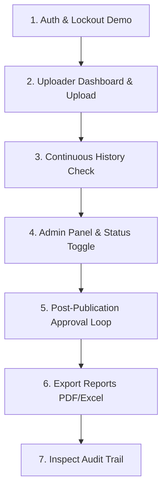

# UPPCL Consolidated Billing System (CBS) - Project Presentation & Explanation Guide

This guide is designed to help you present and explain the **UPPCL Consolidated Billing System (CBS)** to project evaluators, interviewers, clients, or colleagues. It organizes what you did, the engineering decisions you made, the code patterns you implemented, and the answers to anticipated technical questions.

---

## 1. The Elevator Pitch (1-Minute Summary)
> **What to say:**
> "I built the **Consolidated Billing System (CBS)** for the Uttar Pradesh Power Corporation Limited (UPPCL). It's a full-stack dashboard designed to streamline division-wise daily payment reporting across three primary revenue streams: Bank Wire Transfers, Payment Gateways, and Internal Billing Systems. 
>
> What makes this project unique is its focus on high-security and enterprise-grade resilience: 
> 1. It implements a **Unified POST API Architecture** to bypass strict corporate network firewalls that block non-POST HTTP traffic.
> 2. It features **Kubernetes-native resiliency**, including dedicated readiness/liveness probes, an asynchronous MongoDB connection retry loop, and graceful shutdown signal handlers to guarantee zero-downtime rolling upgrades.
> 3. It enforces strict **business workflows** like a prior-date data continuity rule, and an automated audit-log tracking mechanism for all changes."

---

## 2. Key Architecture & Tech Stack
The application is structured as a monolithic single-container service containing:
* **Frontend**: Single Page Application (SPA) built with **React**, **Vite**, **Tailwind CSS**, and **Lucide Icons**.
* **Backend**: **Node.js** with **Express**, using **Mongoose** for modeling data.
* **Database**: **MongoDB** (for flexible, document-based storage of complex, versioned transaction audits and reports).
* **Security & Utilities**: **JWT** (via secure HTTP-only cookies), **Bcrypt.js** (for password hashing), **Helmet** (for security headers), **PDFKit** and **ExcelJS** (for exporting raw data streams).

---

## 3. High-Impact Technical Highlights (What You Actually Built)

### A. The Unified POST API Architecture
* **The Constraint**: Corporate network firewalls and proxy gateways at UPPCL often block or strip HTTP methods like `GET`, `PUT`, and `DELETE`.
* **Your Solution**: You routed all client-side data operations through the HTTP `POST` method.
* **How It Works**:
  * You built a custom client-side API wrapper ([api.js](file:///d:/UPPCL%20Project/FRONTEND/src/services/api.js)) that intercepts all typical requests and converts them:
    * Standard `GET` reads (like fetching uploads or users) are rewritten to `/list` routes (e.g., `POST /api/v1/uploads/list`) with filters sent in the JSON body.
    * Updates (`PUT`/`PATCH`) are issued as `POST` requests.
    * Deletes (`DELETE`) are appended with `/delete` (e.g., `POST /api/v1/users/:id/delete`).
    * File exports/downloads are triggered via `POST` requests carrying filter params in the request body.
  * *Note: Only the native Kubernetes health checks (`/healthz`, `/readyz`) remain as `GET` requests, as cloud orchestrators do not support custom request bodies on probes.*

### B. Kubernetes-Native Resiliency
* **Dedicated Health & Readiness Ports**: The system exposes a primary app listener on port `5000` and a separate lightweight health-check HTTP server on port `5001`.
* **Readiness vs. Liveness Probes**:
  * **Liveness (`GET /healthz`)**: Verifies the Express event loop is alive. If it deadlocks, Kubernetes restarts the pod.
  * **Readiness (`GET /readyz` / `/health`)**: Probes the real-time MongoDB status (`mongoose.connection.readyState`). If the database disconnects, it returns `503 Service Unavailable`, prompting Kubernetes to remove the container from the load balancer pool, ensuring zero traffic is sent to a crippled instance.
* **Non-Blocking Startup & MongoDB Retry Loop**:
  * Instead of crashing on startup if MongoDB is temporarily unavailable (which triggers container crash-loops), the server binds to its port **immediately**.
  * It runs an asynchronous retry loop (5 attempts, 5 seconds apart) to connect to MongoDB, keeping the container responsive to liveness checks while it retries.
* **Graceful Connection Draining**:
  * On receipt of `SIGTERM` or `SIGINT` (common during rolling updates in K8s), a graceful shutdown handler is executed.
  * It stops accepting new requests, drains active HTTP connections, cleanly disconnects the Mongoose connection pool, and executes an emergency timeout exit after 10 seconds to prevent zombie processes.

### C. Advanced Business Workflows & Data Governance
* **Prior-Date Continuity Rule**: To prevent uploaders from introducing holes in the ledger, the backend checks that the division has submitted data for the *immediate previous day* before allowing a submission for a new date.
* **Data Mutation Lifecycle**:
  * **Pre-publication**: If a report has not been published yet for a date, the uploader can edit/overwrite their submission immediately.
  * **Post-publication**: If a consolidated report has already been generated by the admin, any subsequent edits by the uploader will not take effect automatically. Instead, they create a `pending` change request linked to the original via `replacesSubmission`.
  * **Admin Review & Automatic Recalculation**: The administrator reviews the pending request. If approved:
    1. The old submission is marked as `superseded`.
    2. The new submission is marked as `approved`.
    3. The system automatically triggers the Report Recalculation Service to rebuild that day's consolidated report.

### D. Security Hardening & Auditing
* **Failed Login Lockout**: To defend against brute-force attacks, the authentication logic increments a counter upon failed login attempts. At 5 failures, the account is locked for 15 minutes, and the action is logged.
* **Non-Blocking Audit Trail**: All state mutations (uploads, updates, approvals, user status flips) call an asynchronous `logAudit` service. It records snapshots of the `oldValue` and `newValue`. It runs on a best-effort basis, meaning logging failures never block the core transaction.

---

## 4. Showcase Walkthrough (The Live Demo Script)

If you are demoing the app live, follow this structured flow:

1. **Brute Force & Auth Test**:
   * Show the Login Screen. Type a wrong password multiple times to explain the automated **Brute Force Lockout** feature.
   * Log in with valid credentials. Show that the backend issues a secure, **HTTP-only cookie** containing the JWT.
2. **Uploader Dashboard**:
   * Log in as an **Uploader**. Show the clean cards representing *Today's Uploads*, *Collection*, and *Pending/Approved/Rejected* statuses.
   * Click **Upload Data** and enter values for *Bank ID*, *Payment Gateway*, and *Billing System*.
3. **Data Integrity Test (Prior-Date Continuity)**:
   * Try to upload data for a date two days ahead, skipping tomorrow.
   * Point out the error message: *"Previous date data is missing. Please upload the back date first."*
4. **Admin Panel**:
   * Log in as an **Admin**. Navigate to the User Management section.
   * Deactivate a user, then reactivate them. Show how quickly the UI updates.
5. **Post-Publication Change Request Workflow**:
   * Go to reports, and publish a report for a date.
   * Log in as the Uploader and attempt to update the numbers for that date. Explain that since the report is published, this generates a "Pending Change Request" instead of auto-approving.
   * Switch back to the Admin. Open the pending approval dashboard, review the change reason, and click **Approve**.
   * Show that the report is immediately recalculated with the new totals.
6. **Reporting & Multi-Format Exports**:
   * Log in as a **Report User** or **Admin**. Go to the consolidated reports search panel.
   * Export the report to **PDF** or **Excel**. Open the files to show the professional layout.
7. **The Audit Log Viewer**:
   * Go to the Audit Logs tab as an Admin. Show the history of all the login attempts, uploads, approvals, and user status edits.

---

## 5. Potential Interview Questions & Technical Answers

### Q1: Why did you route typical GET requests as POST requests?
> **Answer**: "UPPCL's corporate intranet and security gateways restrict non-POST HTTP methods like GET (with query parameters containing business intelligence), PUT, and DELETE. To ensure full compatibility with the network security environment, we unified our API architecture to use POST. All filters, pagination, and payload details are transmitted securely inside the JSON request body instead of the URL string. This also keeps the URL clean and prevents query parameters from leaking into gateway access logs."

### Q2: Why did you choose MongoDB over a relational database like PostgreSQL?
> **Answer**: "While our core models have clear relationships, payment collections and audit logs are naturally document-centric. 
> 1. The **Consolidated Report** is stored as a pre-aggregated snapshot containing nested divisions' data. Storing this as a single document prevents complex, expensive multi-table joins on every report query.
> 2. The **Audit Log** needs to store variable data structures (since `oldValue` and `newValue` snapshots differ depending on what resource is updated). MongoDB's flexible schema handles mixed JSON snapshots effortlessly without requiring a complex polymorphic schema."

### Q3: How do you handle database failures during startup in a Kubernetes environment?
> **Answer**: "Typically, if a node-app fails to connect to the database on start, it calls `process.exit(1)`. In Kubernetes, this can cause a rapid crash-loop, blocking the container from even starting up. In our implementation, we start the Express server and bind to the HTTP port **immediately** upon container initialization. We then attempt to connect to MongoDB asynchronously in a retry loop. This ensures the container is up and responsive to Kubernetes liveness probes while it gracefully reconnects to the database in the background."

### Q4: How does the Readiness Probe prevent users from getting errors if the DB drops?
> **Answer**: "Our readiness probe is hosted on a separate port and checks the connection state using `mongoose.connection.readyState`. If Mongoose loses its connection to MongoDB, the readiness check fails and returns an HTTP `503`. The Kubernetes Ingress/Service controller immediately detects this and detaches the unhealthy pod from the service load balancer, so no user traffic is routed to it until the database connection is automatically restored."

### Q5: What is the purpose of the graceful shutdown handler?
> **Answer**: "During rolling updates or scaledowns, Kubernetes sends a `SIGTERM` signal. If we immediately terminate the Node process, any active requests (like a large PDF report being generated) will be instantly dropped, leading to client errors. Our graceful shutdown handler traps `SIGTERM`, shuts down the listeners so no new connections are accepted, drains all active HTTP connections, and closes the MongoDB database connection cleanly. We also set a safety timeout that forces an exit if draining takes longer than 10 seconds."

---

## 6. Project Highlights for Your Resume
You can add these bullets directly to your resume or portfolio:
* **Full-Stack Engineering**: Designed and deployed a consolidated billing dashboard using React, Tailwind CSS, Express, and MongoDB.
* **Unified API Design**: Solved restrictive corporate network proxy rules by implementing a Unified POST API Architecture for all CRUD operations, routing parameters via secure request bodies.
* **DevOps & Resiliency**: Built production-ready containers integrated with Kubernetes-native liveness and readiness probes, graceful connection draining (`SIGTERM` handlers), and resilient startup database connection retry loops.
* **Data Integrity & Governance**: Implemented strict date-sequencing validations (prior-date continuity) and a multi-stage approval workflow with a non-blocking asynchronous audit-logging engine tracking complete JSON state diffs.
* **Advanced Exports**: Programmed custom streaming generators using PDFKit and ExcelJS to produce formatted, downloadable reports on demand.
