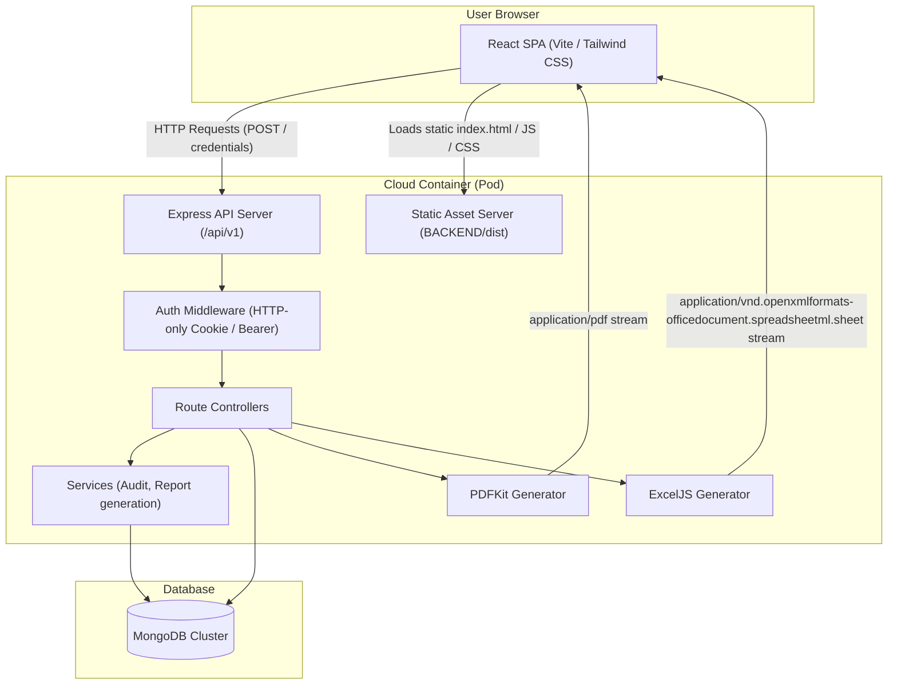
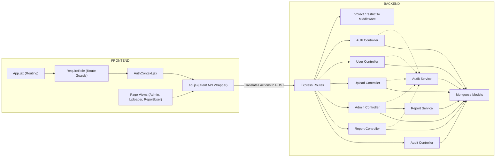
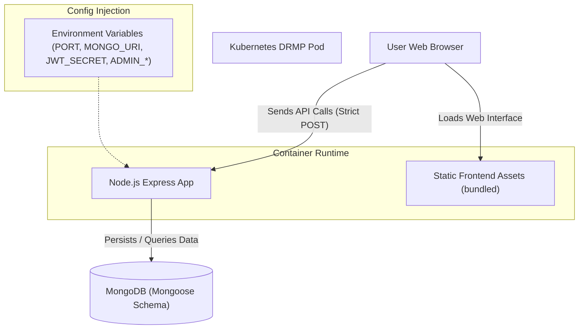
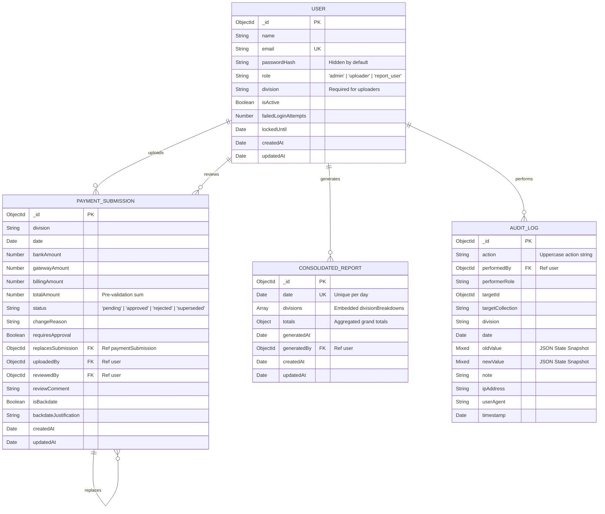
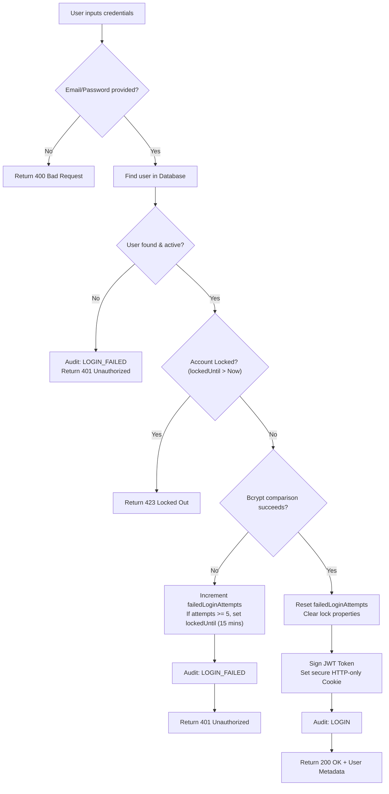
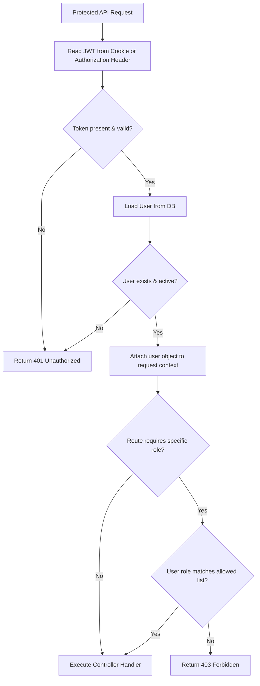
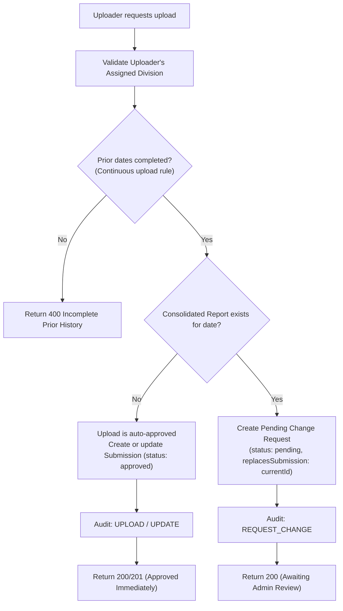
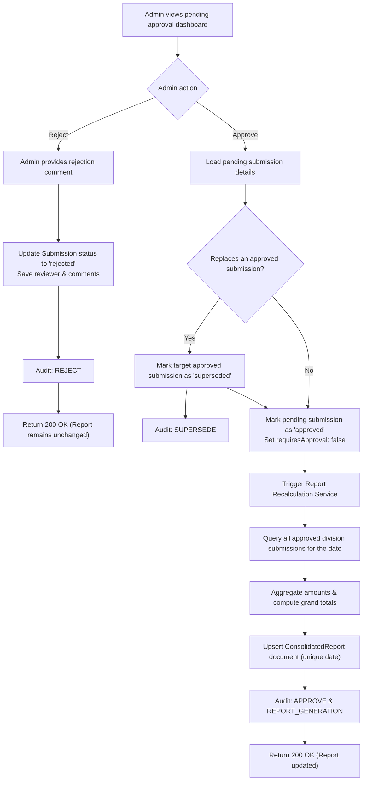
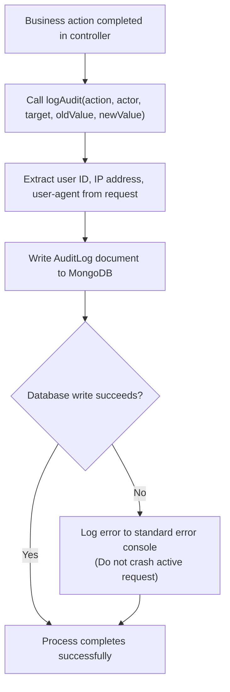

# UPPCL Daily Revenue Monitoring Portal (DRMP)

**Live Deployment:** [https://utkarsh-drmp.duckdns.org](https://utkarsh-drmp.duckdns.org)

A production-grade, full-stack Daily Revenue Monitoring Portal for daily division-wise payment reporting at Uttar Pradesh Power Corporation Limited (UPPCL). The application supports division-level data uploads, multi-stage approval workflows, audit trailing, PDF/Excel generation, and strict role-based access control.

The system is optimized for high-security environments, using a **Unified POST API Architecture** to comply with corporate network security gateways that restrict non-POST HTTP methods, and features **Kubernetes Integration** for resilient orchestration.

---

## Table of Contents
1. [System Overview & Domain Model](#system-overview--domain-model)
2. [System Architecture](#system-architecture)
   - [High-Level Architecture](#high-level-architecture)
   - [Component Topology](#component-topology)
   - [Deployment Topology](#deployment-topology)
3. [Database Design & ER Diagram](#database-design--er-diagram)
4. [Business Workflows & Process Flowcharts](#business-workflows--process-flowcharts)
   - [Authentication & Account Lockout](#authentication--account-lockout)
   - [Authorization & Route Protection](#authorization--route-protection)
   - [Payment Submission Lifecycle](#payment-submission-lifecycle)
   - [Admin Review & Report Generation](#admin-review--report-generation)
   - [Audit Trail Logging](#audit-trail-logging)
5. [Unified POST API Specifications](#unified-post-api-specifications)
6. [Infrastructure & Production Deployment Guide](#infrastructure--production-deployment-guide)
   - [Kubernetes Health Checks (Probes)](#kubernetes-health-checks-probes)
   - [Resilient MongoDB Connection Retry](#resilient-mongodb-connection-retry)
   - [Graceful Shutdown Handler](#graceful-shutdown-handler)
   - [Monolithic Frontend Asset Hosting](#monolithic-frontend-asset-hosting)
   - [Environment Configuration](#environment-configuration)
7. [Local Development Setup](#local-development-setup)
8. [Production Operations & Security Checklist](#production-operations--security-checklist)
9. [Contributors](#contributors)

---

## System Overview & Domain Model

The Daily Revenue Monitoring Portal automates daily division-wise payment reporting across three primary payment sources:
- **Bank ID**: Direct wire transfers and manual bank receipts.
- **Payment Gateway**: Online transactions settled via public gateways.
- **Billing System**: Internal billing platform payments.

### Role-Based Features
- **Admin**:
  - Manages system users (activates, deactivates, deletes, creates).
  - Reviews and approves or rejects pending post-publication data change requests.
  - Publishes daily consolidated reports and resolves data inconsistencies.
  - Audits all security and database actions using the Audit Log Viewer.
- **Uploader**:
  - Submits daily payment amounts for their specific division.
  - Updates historical submissions (pre-publication edits go live immediately; post-publication edits trigger administrative review).
  - Adheres to prior-date data continuity rules (preventing subsequent days' data from being entered if prior dates are missing).
- **Report User**:
  - Searches published reports.
  - Performs multi-dimensional queries (filtering by division, date range, or non-zero source amounts).
  - Exports reports to PDF and Microsoft Excel format.

---

## System Architecture

### High-Level Architecture

The system is deployed as a single-container service (monolith layout) hosting both the static frontend and the Node.js Express API. This design simplifies security configuration, bypassing cross-origin (CORS) complexity and streamlining local and cloud proxy rules.



### Component Topology

The codebase utilizes standard page components coupled with a central API client in the frontend, and a Route-Controller-Service-Model architecture in the backend.



### Deployment Topology



---

## Database Design & ER Diagram

MongoDB collections are designed around normalized schemas, ensuring data isolation, clean foreign key relationships, and atomic document structures for reports.



---

## Business Workflows & Process Flowcharts

### Authentication & Account Lockout

Security is backed by an automated account lockout protocol to defend against brute force password attacks.



### Authorization & Route Protection

All API requests pass through token verification and role restriction middlewares.



### Payment Submission Lifecycle

Submissions can be updated freely before a report is published. Once published, updates trigger an admin review loop.



### Admin Review & Report Generation

When an admin approves a correction to a published report, the system marks the old submission as `superseded` and triggers a report recalculation.



### Audit Trail Logging

Audit trailing is run asynchronously on a best-effort basis, preventing write locks or failures from disrupting user operations.



---

## Unified POST API Specifications

Due to network security restrictions on intermediate corporate gateways, **all client requests (retrievals, updates, and deletes) must be executed using the HTTP `POST` method**. In place of query parameters or standard path parameters for state mutation, data parameters are supplied directly inside the JSON request body.

*Note: Kubernetes diagnostic probes (`/healthz`, `/readyz`) remain mapped to HTTP `GET` as standard cloud probes do not support body payloads.*

### Authentication & Profiles
| Route | Role | Description | Body Schema |
|---|---|---|---|
| `POST /api/v1/auth/login` | Public | Authenticates credentials and sets HTTP-only cookie | `{ "email": "...", "password": "..." }` |
| `POST /api/v1/auth/register` | Public | Creates `uploader` or `report_user` account | `{ "name": "...", "email": "...", "password": "...", "role": "...", "division": "..." }` |
| `POST /api/v1/auth/logout` | Authenticated | Clears user cookie token | `(none)` |
| `POST /api/v1/auth/me` | Authenticated | Returns logged-in user profile | `(none)` |

### User Management
| Route | Role | Description | Body Schema |
|---|---|---|---|
| `POST /api/v1/users/list` | Admin | Fetches accounts list with filters | `{ "role": "...", "isActive": true }` (optional filters) |
| `POST /api/v1/users` | Admin | Creates a new user in any role | `{ "name": "...", "email": "...", "password": "...", "role": "...", "division": "..." }` |
| `POST /api/v1/users/:id/status` | Admin | Updates user's activation status | `{ "isActive": true/false }` |
| `POST /api/v1/users/:id/delete` | Admin | Deletes user (cannot self-delete) | `(none)` |

### Submissions & Uploads
| Route | Role | Description | Body Schema |
|---|---|---|---|
| `POST /api/v1/uploads/list` | Admin, Uploader | Lists submissions (uploader results are division-scoped) | `{ "division": "...", "date": "ISO-date" }` (optional filters) |
| `POST /api/v1/uploads` | Uploader | Creates submission or change request | `{ "date": "ISO-date", "bankAmount": 100, "gatewayAmount": 200, "billingAmount": 300, "isBackdate": false, "backdateJustification": "..." }` |
| `POST /api/v1/uploads/:id` | Uploader | Updates draft/pending submission details | `{ "bankAmount": 150, "gatewayAmount": 220, "billingAmount": 310 }` |

### Administrative Workflows
| Route | Role | Description | Body Schema |
|---|---|---|---|
| `POST /api/v1/admin/pending` | Admin | Lists change submissions awaiting review | `(none)` |
| `POST /api/v1/admin/uploads/:id/approve` | Admin | Approves submission, regenerates report | `{ "reviewComment": "Verified with bank statements" }` |
| `POST /api/v1/admin/uploads/:id/reject` | Admin | Rejects submission (requires comment) | `{ "reviewComment": "Invalid amount values" }` |
| `POST /api/v1/admin/reports/:date/publish` | Admin | Generates initial report for a date | `(none)` |

### Reports & Analytics
| Route | Role | Description | Body Schema / Output |
|---|---|---|---|
| `POST /api/v1/reports/list` | Admin, Report User | Lists reports in a date range | `{ "from": "ISO-date", "to": "ISO-date" }` |
| `POST /api/v1/reports/:date` | Admin, Report User | Gets report details for a date | `{ "division": "..." }` (optional filter) |
| `POST /api/v1/reports/:date/export/pdf` | Admin, Report User | Generates downloadable PDF | `{ "division": "..." }` -> Output: `application/pdf` |
| `POST /api/v1/reports/:date/export/excel` | Admin, Report User | Generates downloadable XLSX | `{ "division": "..." }` -> Output: binary XLSX stream |

### Audit Logging
| Route | Role | Description | Body Schema |
|---|---|---|---|
| `POST /api/v1/audit/list` | Admin | Lists paginated system audit logs | `{ "page": 1, "limit": 50, "action": "...", "division": "..." }` |

---

## Infrastructure & Production Deployment Guide

The DRMP application architecture is designed for modern orchestration in environments like Kubernetes, Docker, or serverless containers.

### Kubernetes Health Checks (Probes)

To distinguish between application startup health and database connectivity, the system exposes two dedicated endpoints:
1. **Liveness Probe (`GET /healthz`)**:
   - Ensures the Express server is up and responsive to requests.
   - If this check fails (e.g., event loop deadlock), Kubernetes terminates and restarts the container pod.
2. **Readiness Probe (`GET /readyz`)**:
   - Checks the connection status of the MongoDB instance using `mongoose.connection.readyState`.
   - Returns a `200 OK` status only when Mongoose is connected (`readyState === 1`).
   - If the database disconnects, it returns `503 Service Unavailable`, prompting the Kubernetes service controller to remove this pod from the load balancer pool. This prevents routing traffic to pods with broken DB connections.

### Resilient MongoDB Connection Retry

When containers spin up concurrently, the application database connection wrapper prevents startup crashes if the database server is not yet initialized:
- The startup process executes an asynchronous connection loop that retries up to 5 times at 5-second intervals.
- The HTTP listener binds to the port **immediately**, preventing the container from failing Kubernetes liveness probes during DB connection retries.
- Mongoose hooks monitor connection status changes (`connected`, `error`, `disconnected`) and write notices directly to standard output for cluster monitoring.

### Graceful Shutdown Handler

To prevent dropped requests during rolling upgrades or pod scaling operations, the server catches `SIGTERM` and `SIGINT` signals:
1. **Connection Draining**: The server stops accepting new connections via `server.close()`, letting existing active HTTP connections terminate naturally.
2. **Resource Cleanup**: Once connections are drained, the handler closes the MongoDB connection pool (`mongoose.connection.close(false)`).
3. **Emergency Timeout**: If socket cleanup hangs, a safety timer (default: 10 seconds) forces process termination (`process.exit(1)`) to avoid zombie containers.

### Monolithic Frontend Asset Hosting

For simplified, cost-effective deployments, the Express app statically serves frontend assets.
- Production builds (`npm run build` in `FRONTEND`) are placed in the backend's `dist/` directory.
- A wildcard routing middleware redirects any non-API GET request to `dist/index.html`, allowing React Router to handle client-side routing.

### Environment Configuration

The application is configured using environment variables. These should be mounted securely (e.g., using Kubernetes Secrets or Vault) in production.

#### Backend Configuration (`BACKEND/.env`)
| Variable | Required | Default | Description |
|---|---|---|---|
| `PORT` | Yes | `5000` | Port the Express application binds to. |
| `MONGO_URI` | Yes | `(none)` | Connection string for MongoDB database. |
| `JWT_SECRET` | Yes | `(none)` | Long, random cryptographic key for JWT signing. |
| `JWT_EXPIRES_IN` | No | `8h` | Token expiration period. |
| `FRONTEND_URL` | No | `http://localhost:5173` | CORS allowed origin when run in split-container mode. |
| `SHUTDOWN_TIMEOUT_MS`| No | `10000` | Safety threshold before a graceful shutdown is forced. |
| `ADMIN_NAME` | Yes (Seeding) | `(none)` | System Administrator name for seed scripts. |
| `ADMIN_EMAIL` | Yes (Seeding) | `(none)` | System Administrator email for seed scripts. |
| `ADMIN_PASSWORD` | Yes (Seeding) | `(none)` | System Administrator password for seed scripts. |

#### Frontend Configuration (`FRONTEND/.env`)
| Variable | Required | Default | Description |
|---|---|---|---|
| `VITE_API_URL` | No | `http://localhost:5000/api/v1` | Target URL for backend API operations (split deployment). |

---

## Local Development Setup

To test the application locally on your workstation, follow these steps:

### Prerequisites
- Node.js (v18 or newer)
- MongoDB Server (v6.x or newer) running locally or remotely

### 1. Database & Backend Configuration
Clone the repository, initialize backend dependencies, and create your local environment file:
```bash
cd BACKEND
npm install
copy .env.example .env
```
Open `BACKEND/.env` and update configuration parameters, specifically `MONGO_URI` and `JWT_SECRET`.

### 2. Seed Administrator Account
Populate the database with the initial administrator account. The script will look for variables prefixed with `ADMIN_*` in your `.env`:
```bash
npm run seed:admin
```

### 3. Run Backend (Development Mode)
Launch the server in watch mode. It will run on `http://localhost:5000`:
```bash
npm run dev
```

### 4. Frontend Configuration & Execution
In a new terminal window, initialize frontend configurations and start the Vite dev server:
```bash
cd ../FRONTEND
npm install
copy .env.example .env
npm run dev
```
By default, the Vite dev server runs at `http://localhost:5173`. Open this URL in your browser to verify operations.

---

## Production Operations & Security Checklist

When deploying to production, follow these security practices:

- [ ] **Cryptographic Secrets**: Generate a 256-bit cryptographically strong value for `JWT_SECRET`. Do not reuse local development secrets.
- [ ] **Secure Cookies**: In production (`NODE_ENV=production`), the application forces the `secure` flag on authentication cookies, ensuring they are only transmitted over secure HTTPS connections.
- [ ] **No Env Commits**: Ensure `.env` is listed in your `.gitignore` to prevent committing credentials to git history.
- [ ] **Database Indexes**: Verify the following indexes are built in MongoDB for optimal search speeds:
  - `paymentSubmissions`: `{ division: 1, date: 1 }`, `{ status: 1, date: -1 }`
  - `consolidatedReports`: `{ date: 1 }` (unique)
  - `auditLogs`: `{ action: 1, timestamp: -1 }`, `{ division: 1, date: -1 }`
- [ ] **Docker Builds**: When writing a Dockerfile, optimize container security by using node-alpine base images and starting the process under a non-root `node` user:
  ```dockerfile
  FROM node:18-alpine
  USER node
  # Additional configuration goes here...
  ```

---

## Contributors

**Utkarsh Aryan Mishra**  
*Backend & DevOps Engineer*  
- Database architecture & schema design.
- Business logic, validation structures, and API creation.
- Security wrappers and integration of export templates.

**Ajuruddin Ali**  
*Frontend Developer & DevOps Engineer*  
- React components, interfaces, and single-page routing.
- Dashboard layouts, data visualization, and client-side styling.
- Authentication integration and file download handlers.
