# UPPCL Consolidated Billing System

Technical Design and System Documentation Package  
Reverse engineered from source code on 2026-06-22.

## Evidence Basis

This document treats the repository source as the source of truth. Main files reviewed:

- Backend entry points: `BACKEND/server.js`, `BACKEND/src/app.js`
- Backend routes: `BACKEND/src/routes/*.routes.js`
- Backend controllers: `BACKEND/src/controllers/*.controller.js`
- Backend services: `BACKEND/src/services/*.service.js`
- Backend models: `BACKEND/src/models/*.model.js`
- Backend middleware/utilities: `BACKEND/src/middleware/*.js`, `BACKEND/src/utils/*.js`
- Admin seed script: `BACKEND/scripts/seedAdmin.js`
- Frontend routes and auth: `FRONTEND/src/App.jsx`, `FRONTEND/src/context/AuthContext.jsx`, `FRONTEND/src/components/RequireRole.jsx`
- Frontend pages: `FRONTEND/src/pages/**`
- Frontend API client: `FRONTEND/src/services/api.js`

## Executive Summary

The system is a full-stack Consolidated Billing System for division-wise daily payment reporting. It supports authenticated users in three roles: `admin`, `uploader`, and `report_user`.

Uploaders submit daily amounts for their assigned division across three source categories: Bank ID, Payment Gateway, and Billing System. Before a consolidated report is published for a date, uploader submissions are stored as approved data and can be edited directly. After a report exists for a date, uploader edits become pending change requests. Admin users approve or reject pending changes, publish consolidated daily reports, manage users, and view audit logs. Report users search, view, and export published reports.

The backend is an Express/Mongoose API backed by MongoDB. The frontend is a React/Vite single-page application with role-based routing. Authentication uses JWTs stored in HTTP-only cookies and accepted from bearer authorization headers.

## Implemented Feature Inventory

### Authentication and Session Management

- Login with email/password: `POST /api/v1/auth/login`
- Public registration for `uploader` and `report_user`: `POST /api/v1/auth/register`
- Logout: `POST /api/v1/auth/logout`
- Current user lookup: `GET /api/v1/auth/me`
- Password hashing with `bcryptjs`
- JWT signing with configurable expiry
- HTTP-only cookie named `token`
- Failed login counter and 15-minute lockout after 5 failed attempts
- Inactive user rejection during authentication

Source: `BACKEND/src/controllers/auth.controller.js`, `BACKEND/src/utils/jwt.js`, `BACKEND/src/middleware/auth.middleware.js`, `BACKEND/src/models/user.model.js`.

### Role-Based Authorization

- `admin`: user management, pending approvals, report publishing, audit logs, report search/export.
- `uploader`: create/list/edit submissions for own assigned division.
- `report_user`: list/search/view/export published reports.

Source: route middleware in `BACKEND/src/routes/*.routes.js`; frontend route guards in `FRONTEND/src/App.jsx` and `FRONTEND/src/components/RequireRole.jsx`.

### User Management

- Admin list users with optional role/status filters.
- Admin creates users in any supported role.
- Admin activates/deactivates users.
- Admin deletes users, except their own logged-in account.
- Public registration excludes `admin`.
- Admin seeding/reset script creates or resets admin account from environment variables.

Source: `BACKEND/src/controllers/user.controller.js`, `BACKEND/scripts/seedAdmin.js`, `FRONTEND/src/pages/admin/UserManagement.jsx`.

### Submission Management

- Uploader creates payment submissions.
- Uploader submissions are tied to uploader division.
- Amounts must be numeric and non-negative.
- `totalAmount` is computed in a Mongoose pre-validation hook.
- Backdate detection is stored as `isBackdate`; optional justification is stored.
- Missing prior date rule prevents later upload if a previous day is missing after prior data exists.
- Before publication, same-date edits update approved submission directly.
- After publication, edits become pending change requests requiring admin review.
- Rejected and superseded submissions cannot be edited.
- Admin and uploader can list submissions; uploader list is division scoped.

Source: `BACKEND/src/controllers/upload.controller.js`, `BACKEND/src/models/paymentSubmission.model.js`, `FRONTEND/src/pages/uploader/*.jsx`.

### Admin Review and Report Publication

- Admin lists pending submissions.
- Admin approves pending submissions.
- Approval sets submission to approved, clears `requiresApproval`, stores reviewer/comment, regenerates report.
- If a pending submission replaces an approved submission, prior submission becomes `superseded`.
- Admin rejects pending submissions with required rejection reason.
- Admin publishes report for a date.
- Report publication checks previous report continuity if earlier reports exist.

Source: `BACKEND/src/controllers/admin.controller.js`, `BACKEND/src/services/report.service.js`, `FRONTEND/src/pages/admin/*.jsx`.

### Reports, Search, and Export

- Admin/report users list consolidated reports.
- Filters: date range and division.
- Report detail by date.
- Division-scoped view via `division` query parameter.
- Export published report to PDF.
- Export published report to Excel.
- Frontend search additionally filters visible rows by non-zero source amount.

Source: `BACKEND/src/controllers/report.controller.js`, `FRONTEND/src/pages/reportuser/*.jsx`, `FRONTEND/src/hooks/useReports.js`.

### Audit Logging

- Audit log documents capture action, actor, role, target, old/new value snapshots, notes, request IP, user-agent, timestamp.
- Implemented actions include `CREATE_USER`, `LOGIN`, `LOGIN_FAILED`, `LOGOUT`, `UPLOAD`, `UPDATE`, `REQUEST_CHANGE`, `APPROVE`, `REJECT`, `SUPERSEDE`, `REPORT_GENERATION`, `REPORT_PUBLICATION`, `EXPORT_PDF`, `EXPORT_EXCEL`, `ACTIVATE_USER`, `DEACTIVATE_USER`, `DELETE_USER`.
- Audit failures are logged to server console and do not block primary workflow.
- Admin can list audit logs with filters and pagination.

Source: `BACKEND/src/services/audit.service.js`, `BACKEND/src/controllers/audit.controller.js`, `BACKEND/src/models/auditLog.model.js`.

### Source-Level Discrepancies

- `BACKEND/postman/UPPCL-CBS-API.postman_collection.json` references `GET /api/v1/uploads/:id` and `GET /api/v1/audit/:id`, but route files do not implement these endpoints.
- `FRONTEND/src/pages/admin/AdminDashboard.jsx` calls `GET /api/v1/uploads` as an admin, which is supported by `upload.routes.js`.
- `FRONTEND/src/pages/reportuser/ReportDetail.jsx` derives detail data from route id formatted as `date:division`, then calls `GET /api/v1/reports/:date`.

## Technology Stack

| Layer | Technology | Source |
|---|---|---|
| Frontend | React 18, Vite, React Router | `FRONTEND/package.json` |
| Styling/UI | Tailwind CSS, lucide-react, clsx | `FRONTEND/package.json` |
| Backend | Node.js, Express 5 | `BACKEND/package.json` |
| Database | MongoDB via Mongoose | `BACKEND/package.json`, `BACKEND/src/db/db.js` |
| Auth | JWT, HTTP-only cookie, bcryptjs | `BACKEND/src/utils/jwt.js`, `auth.controller.js` |
| Exports | PDFKit, ExcelJS | `BACKEND/src/controllers/report.controller.js` |
| Config | dotenv, env vars | `BACKEND/server.js`, `BACKEND/src/db/db.js` |

## Folder Structure

```text
BACKEND/
  server.js
  src/
    app.js
    controllers/
    db/
    middleware/
    models/
    routes/
    services/
    utils/
  scripts/
  postman/

FRONTEND/
  src/
    App.jsx
    main.jsx
    components/
    context/
    data/
    hooks/
    layouts/
    pages/
    services/
```

## API Overview

| Method | Path | Roles | Purpose |
|---|---|---|---|
| GET | `/` | Public | Health/status text |
| POST | `/api/v1/auth/login` | Public | Authenticate user |
| POST | `/api/v1/auth/register` | Public | Register uploader/report user |
| POST | `/api/v1/auth/logout` | Authenticated | Clear auth cookie |
| GET | `/api/v1/auth/me` | Authenticated | Return current user |
| GET | `/api/v1/users` | admin | List users |
| POST | `/api/v1/users` | admin | Create user |
| PATCH | `/api/v1/users/:id/status` | admin | Activate/deactivate user |
| DELETE | `/api/v1/users/:id` | admin | Delete user |
| GET | `/api/v1/uploads` | uploader, admin | List submissions |
| POST | `/api/v1/uploads` | uploader | Create submission/change request |
| PUT | `/api/v1/uploads/:id` | uploader | Edit submission/change request |
| GET | `/api/v1/admin/pending` | admin | List pending submissions |
| POST | `/api/v1/admin/reports/:date/publish` | admin | Publish/generate report |
| PATCH | `/api/v1/admin/uploads/:id/approve` | admin | Approve pending submission |
| PATCH | `/api/v1/admin/uploads/:id/reject` | admin | Reject pending submission |
| GET | `/api/v1/reports` | admin, report_user | List reports |
| GET | `/api/v1/reports/:date` | admin, report_user | Get report by date |
| GET | `/api/v1/reports/:date/export/pdf` | admin, report_user | Export PDF |
| GET | `/api/v1/reports/:date/export/excel` | admin, report_user | Export Excel |
| GET | `/api/v1/audit` | admin | List audit logs |

## Database Design

### Data Dictionary

#### User

| Field | Type | Constraints / Notes |
|---|---|---|
| `_id` | ObjectId | Primary key |
| `name` | String | Required |
| `email` | String | Required, unique |
| `passwordHash` | String | Required, `select: false` |
| `role` | String | Enum: `admin`, `uploader`, `report_user`; default `report_user` |
| `division` | String | Trimmed; required when role is `uploader` |
| `isActive` | Boolean | Default `true` |
| `failedLoginAttempts` | Number | Default `0`, `select: false` |
| `lockedUntil` | Date | `select: false` |
| `createdAt` | Date | Mongoose timestamps |
| `updatedAt` | Date | Mongoose timestamps |

Source: `BACKEND/src/models/user.model.js`.

#### PaymentSubmission

| Field | Type | Constraints / Notes |
|---|---|---|
| `_id` | ObjectId | Primary key |
| `division` | String | Required, trimmed |
| `date` | Date | Required; normalized in controllers |
| `bankAmount` | Number | Required, min 0, default 0 |
| `gatewayAmount` | Number | Required, min 0, default 0 |
| `billingAmount` | Number | Required, min 0, default 0 |
| `totalAmount` | Number | Required, min 0, default 0; computed pre-validate |
| `status` | String | Enum: `pending`, `approved`, `rejected`, `superseded`; default `pending` |
| `changeReason` | String | Enum: `initial_upload`, `pre_publish_edit`, `post_publish_change` |
| `requiresApproval` | Boolean | Default `true` |
| `replacesSubmission` | ObjectId | FK to `paymentSubmission`, nullable |
| `uploadedBy` | ObjectId | Required FK to `user` |
| `reviewedBy` | ObjectId | FK to `user`, nullable |
| `reviewComment` | String | Trimmed |
| `isBackdate` | Boolean | Default `false` |
| `backdateJustification` | String | Trimmed |
| `createdAt` | Date | Mongoose timestamps |
| `updatedAt` | Date | Mongoose timestamps |

Indexes: `{ division: 1, date: 1 }`, `{ status: 1, date: -1 }`, `{ uploadedBy: 1, createdAt: -1 }`.

Source: `BACKEND/src/models/paymentSubmission.model.js`.

#### ConsolidatedReport

| Field | Type | Constraints / Notes |
|---|---|---|
| `_id` | ObjectId | Primary key |
| `date` | Date | Required, unique |
| `divisions[]` | Embedded array | Division totals |
| `divisions[].division` | String | Required, trimmed |
| `divisions[].bankAmount` | Number | Required, min 0, default 0 |
| `divisions[].gatewayAmount` | Number | Required, min 0, default 0 |
| `divisions[].billingAmount` | Number | Required, min 0, default 0 |
| `divisions[].total` | Number | Required, min 0, default 0 |
| `totals.totalBank` | Number | Required, min 0, default 0 |
| `totals.totalGateway` | Number | Required, min 0, default 0 |
| `totals.totalBilling` | Number | Required, min 0, default 0 |
| `totals.grandTotal` | Number | Required, min 0, default 0 |
| `generatedAt` | Date | Default `Date.now` |
| `generatedBy` | ObjectId | FK to `user`, nullable |
| `createdAt` | Date | Mongoose timestamps |
| `updatedAt` | Date | Mongoose timestamps |

Source: `BACKEND/src/models/consolidatedReport.model.js`.

#### AuditLog

| Field | Type | Constraints / Notes |
|---|---|---|
| `_id` | ObjectId | Primary key |
| `action` | String | Required, trimmed, uppercase |
| `performedBy` | ObjectId | FK to `user`, nullable |
| `performerRole` | String | Enum: `admin`, `uploader`, `report_user`, `system`; default `system` |
| `targetId` | ObjectId | Nullable generic target id |
| `targetCollection` | String | Trimmed generic target collection |
| `division` | String | Trimmed |
| `date` | Date | Business/report date |
| `oldValue` | Mixed | Nullable snapshot |
| `newValue` | Mixed | Nullable snapshot |
| `note` | String | Trimmed |
| `ipAddress` | String | Trimmed |
| `userAgent` | String | Trimmed |
| `timestamp` | Date | Default `Date.now` |

Indexes: `{ action: 1, timestamp: -1 }`, `{ performedBy: 1, timestamp: -1 }`, `{ division: 1, date: -1 }`.

Source: `BACKEND/src/models/auditLog.model.js`.

### ER Diagram

#### Mermaid Source

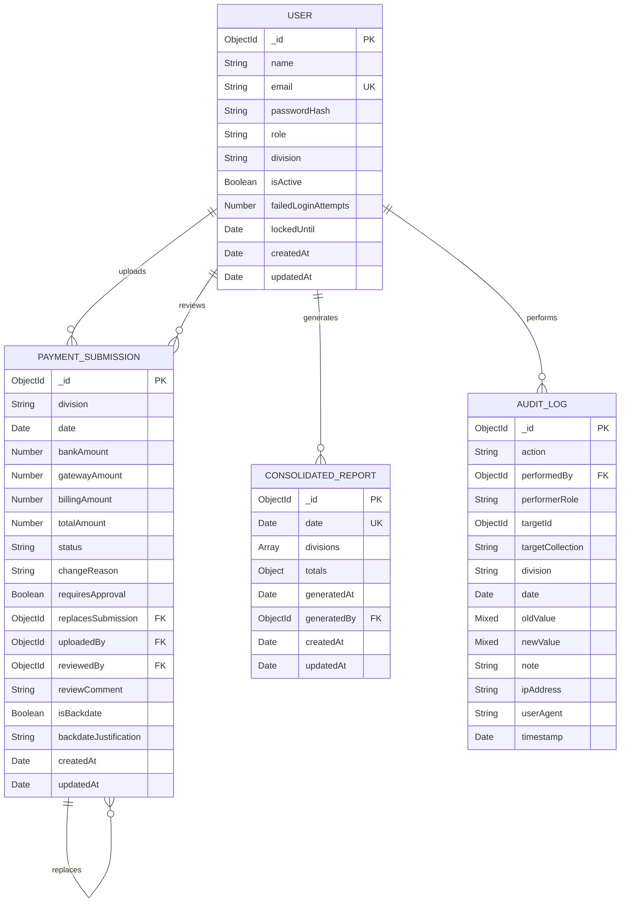
```mermaid
erDiagram
  USER {
    ObjectId _id PK
    String name
    String email UK
    String passwordHash
    String role
    String division
    Boolean isActive
    Number failedLoginAttempts
    Date lockedUntil
    Date createdAt
    Date updatedAt
  }

  PAYMENT_SUBMISSION {
    ObjectId _id PK
    String division
    Date date
    Number bankAmount
    Number gatewayAmount
    Number billingAmount
    Number totalAmount
    String status
    String changeReason
    Boolean requiresApproval
    ObjectId replacesSubmission FK
    ObjectId uploadedBy FK
    ObjectId reviewedBy FK
    String reviewComment
    Boolean isBackdate
    String backdateJustification
    Date createdAt
    Date updatedAt
  }

  CONSOLIDATED_REPORT {
    ObjectId _id PK
    Date date UK
    Array divisions
    Object totals
    Date generatedAt
    ObjectId generatedBy FK
    Date createdAt
    Date updatedAt
  }

  AUDIT_LOG {
    ObjectId _id PK
    String action
    ObjectId performedBy FK
    String performerRole
    ObjectId targetId
    String targetCollection
    String division
    Date date
    Mixed oldValue
    Mixed newValue
    String note
    String ipAddress
    String userAgent
    Date timestamp
  }

  USER ||--o{ PAYMENT_SUBMISSION : uploads
  USER ||--o{ PAYMENT_SUBMISSION : reviews
  PAYMENT_SUBMISSION ||--o{ PAYMENT_SUBMISSION : replaces
  USER ||--o{ CONSOLIDATED_REPORT : generates
  USER ||--o{ AUDIT_LOG : performs
```

#### PlantUML Source

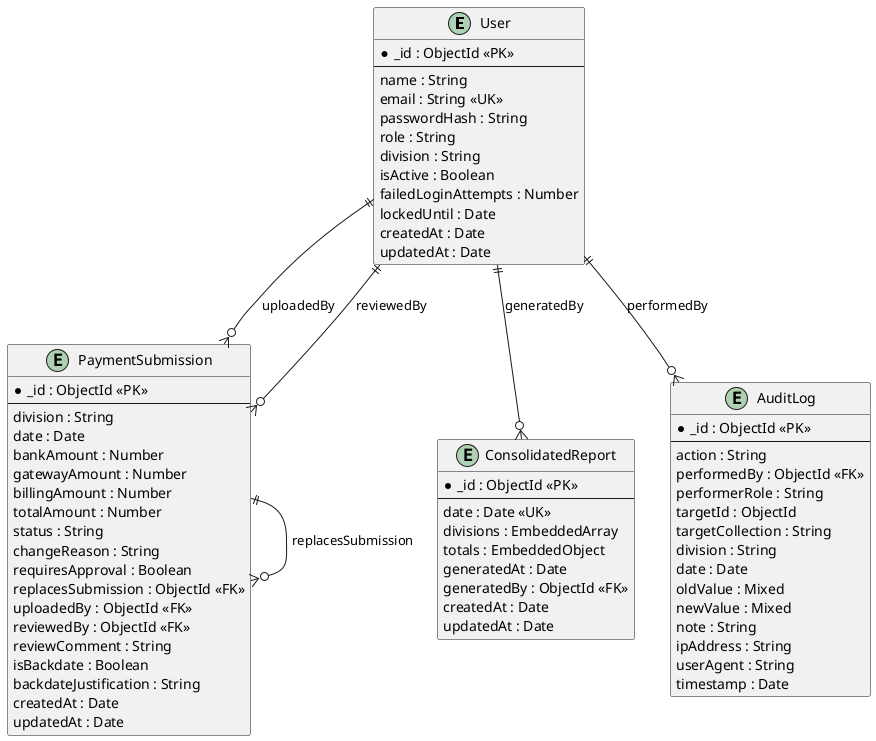
```plantuml
@startuml
entity "User" as User {
  * _id : ObjectId <<PK>>
  --
  name : String
  email : String <<UK>>
  passwordHash : String
  role : String
  division : String
  isActive : Boolean
  failedLoginAttempts : Number
  lockedUntil : Date
  createdAt : Date
  updatedAt : Date
}

entity "PaymentSubmission" as Submission {
  * _id : ObjectId <<PK>>
  --
  division : String
  date : Date
  bankAmount : Number
  gatewayAmount : Number
  billingAmount : Number
  totalAmount : Number
  status : String
  changeReason : String
  requiresApproval : Boolean
  replacesSubmission : ObjectId <<FK>>
  uploadedBy : ObjectId <<FK>>
  reviewedBy : ObjectId <<FK>>
  reviewComment : String
  isBackdate : Boolean
  backdateJustification : String
  createdAt : Date
  updatedAt : Date
}

entity "ConsolidatedReport" as Report {
  * _id : ObjectId <<PK>>
  --
  date : Date <<UK>>
  divisions : EmbeddedArray
  totals : EmbeddedObject
  generatedAt : Date
  generatedBy : ObjectId <<FK>>
  createdAt : Date
  updatedAt : Date
}

entity "AuditLog" as Audit {
  * _id : ObjectId <<PK>>
  --
  action : String
  performedBy : ObjectId <<FK>>
  performerRole : String
  targetId : ObjectId
  targetCollection : String
  division : String
  date : Date
  oldValue : Mixed
  newValue : Mixed
  note : String
  ipAddress : String
  userAgent : String
  timestamp : Date
}

User ||--o{ Submission : uploadedBy
User ||--o{ Submission : reviewedBy
Submission ||--o{ Submission : replacesSubmission
User ||--o{ Report : generatedBy
User ||--o{ Audit : performedBy
@enduml
```

#### Diagram Explanation

Users upload and review payment submissions. Submissions can self-reference through `replacesSubmission` for post-publication correction workflows. Consolidated reports store embedded division breakdowns generated from approved submissions for a date. Audit logs reference a performer and a generic target by id/collection.

### Database Relationship Diagram

#### Mermaid Source

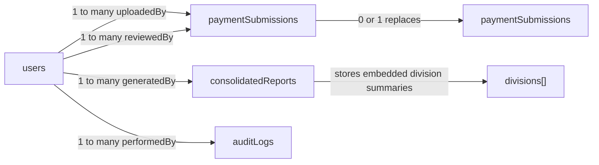
```mermaid
flowchart LR
  U[users]
  PS[paymentSubmissions]
  CR[consolidatedReports]
  AL[auditLogs]
  PS2[paymentSubmissions]

  U -- "1 to many uploadedBy" --> PS
  U -- "1 to many reviewedBy" --> PS
  PS -- "0 or 1 replaces" --> PS2
  U -- "1 to many generatedBy" --> CR
  U -- "1 to many performedBy" --> AL
  CR -- "stores embedded division summaries" --> DIV["divisions[]"]
```

#### PlantUML Source

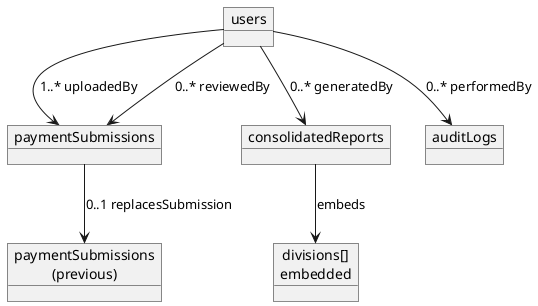
```plantuml
@startuml
object users
object paymentSubmissions
object consolidatedReports
object auditLogs
object "paymentSubmissions\n(previous)" as previousSubmission
object "divisions[]\nembedded" as divisions

users --> paymentSubmissions : 1..* uploadedBy
users --> paymentSubmissions : 0..* reviewedBy
paymentSubmissions --> previousSubmission : 0..1 replacesSubmission
users --> consolidatedReports : 0..* generatedBy
users --> auditLogs : 0..* performedBy
consolidatedReports --> divisions : embeds
@enduml
```

#### Diagram Explanation

This view emphasizes cardinality and storage style. Report division breakdowns are embedded in consolidated report documents, not stored as a separate collection.

## System Architecture

### High-Level Architecture Diagram

#### Mermaid Source

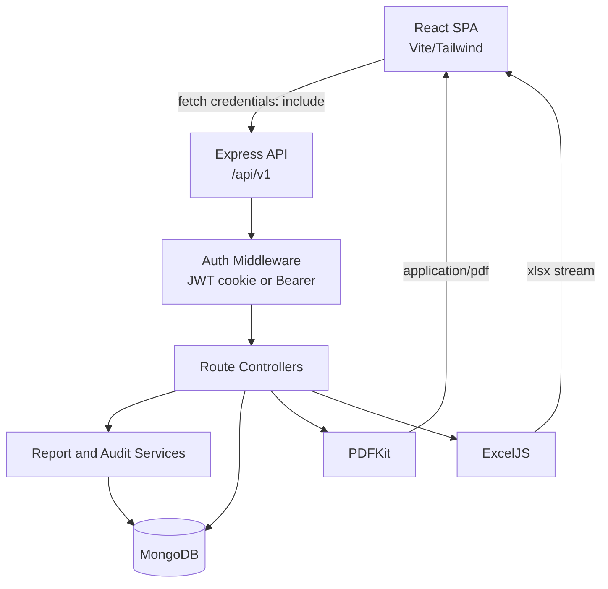
```mermaid
flowchart TB
  Browser[React SPA\nVite/Tailwind]
  API[Express API\n/api/v1]
  Auth[Auth Middleware\nJWT cookie or Bearer]
  Controllers[Route Controllers]
  Services[Report and Audit Services]
  Mongo[(MongoDB)]
  PDF[PDFKit]
  Excel[ExcelJS]

  Browser -- "fetch credentials: include" --> API
  API --> Auth
  Auth --> Controllers
  Controllers --> Services
  Controllers --> Mongo
  Services --> Mongo
  Controllers --> PDF
  Controllers --> Excel
  PDF -- "application/pdf" --> Browser
  Excel -- "xlsx stream" --> Browser
```

#### PlantUML Source

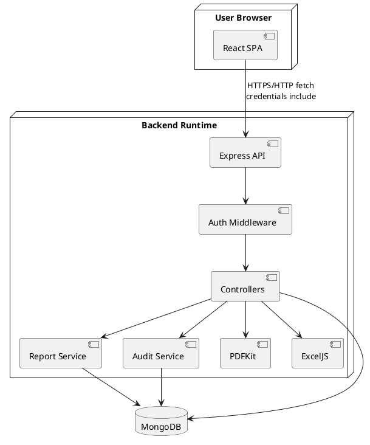
```plantuml
@startuml
node "User Browser" {
  component "React SPA" as SPA
}

node "Backend Runtime" {
  component "Express API" as API
  component "Auth Middleware" as Auth
  component "Controllers" as Controllers
  component "Report Service" as ReportService
  component "Audit Service" as AuditService
  component "PDFKit" as PDF
  component "ExcelJS" as Excel
}

database "MongoDB" as Mongo

SPA --> API : HTTPS/HTTP fetch\ncredentials include
API --> Auth
Auth --> Controllers
Controllers --> ReportService
Controllers --> AuditService
Controllers --> Mongo
ReportService --> Mongo
AuditService --> Mongo
Controllers --> PDF
Controllers --> Excel
@enduml
```

#### Diagram Explanation

The frontend is a browser SPA. API requests use cookies with CORS credentials. Express routes apply authentication and authorization middleware before controller logic. Controllers use Mongoose models directly and call report/audit services. PDF and Excel exports are generated on demand.

### Component Diagram

#### Mermaid Source

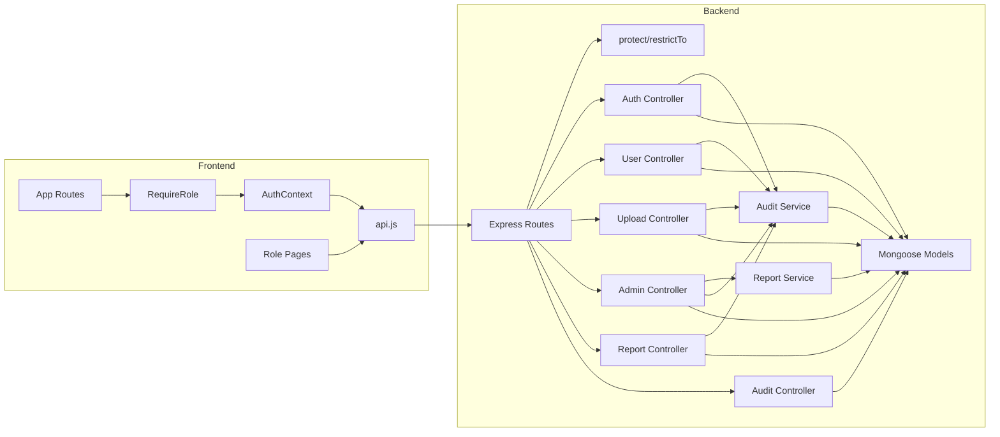
```mermaid
flowchart LR
  subgraph Frontend
    App[App Routes]
    AuthCtx[AuthContext]
    Guard[RequireRole]
    Pages[Role Pages]
    ApiClient[api.js]
  end

  subgraph Backend
    Routes[Express Routes]
    AuthMW[protect/restrictTo]
    AuthC[Auth Controller]
    UserC[User Controller]
    UploadC[Upload Controller]
    AdminC[Admin Controller]
    ReportC[Report Controller]
    AuditC[Audit Controller]
    ReportS[Report Service]
    AuditS[Audit Service]
    Models[Mongoose Models]
  end

  App --> Guard
  Guard --> AuthCtx
  Pages --> ApiClient
  AuthCtx --> ApiClient
  ApiClient --> Routes
  Routes --> AuthMW
  Routes --> AuthC
  Routes --> UserC
  Routes --> UploadC
  Routes --> AdminC
  Routes --> ReportC
  Routes --> AuditC
  UploadC --> AuditS
  AdminC --> ReportS
  AdminC --> AuditS
  ReportC --> AuditS
  AuthC --> AuditS
  UserC --> AuditS
  AuthC --> Models
  UserC --> Models
  UploadC --> Models
  AdminC --> Models
  ReportC --> Models
  AuditC --> Models
  ReportS --> Models
  AuditS --> Models
```

#### PlantUML Source

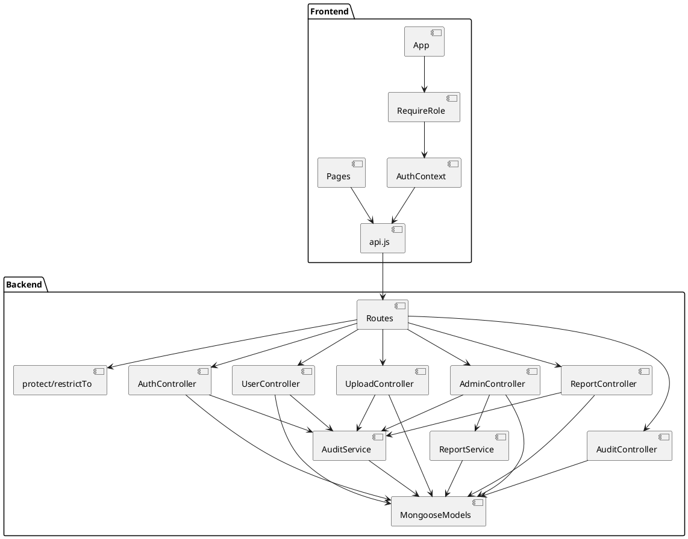
```plantuml
@startuml
package "Frontend" {
  component App
  component AuthContext
  component RequireRole
  component Pages
  component "api.js" as ApiClient
}

package "Backend" {
  component Routes
  component "protect/restrictTo" as AuthMW
  component AuthController
  component UserController
  component UploadController
  component AdminController
  component ReportController
  component AuditController
  component ReportService
  component AuditService
  component MongooseModels
}

App --> RequireRole
RequireRole --> AuthContext
Pages --> ApiClient
AuthContext --> ApiClient
ApiClient --> Routes
Routes --> AuthMW
Routes --> AuthController
Routes --> UserController
Routes --> UploadController
Routes --> AdminController
Routes --> ReportController
Routes --> AuditController
UploadController --> AuditService
AdminController --> ReportService
AdminController --> AuditService
ReportController --> AuditService
AuthController --> AuditService
UserController --> AuditService
AuthController --> MongooseModels
UserController --> MongooseModels
UploadController --> MongooseModels
AdminController --> MongooseModels
ReportController --> MongooseModels
AuditController --> MongooseModels
ReportService --> MongooseModels
AuditService --> MongooseModels
@enduml
```

#### Diagram Explanation

The codebase follows a straightforward frontend page/API-client pattern and backend route/controller/service/model pattern. Report generation and audit logging are extracted into services; most validation and workflow branching remains in controllers.

### Deployment Diagram

#### Mermaid Source

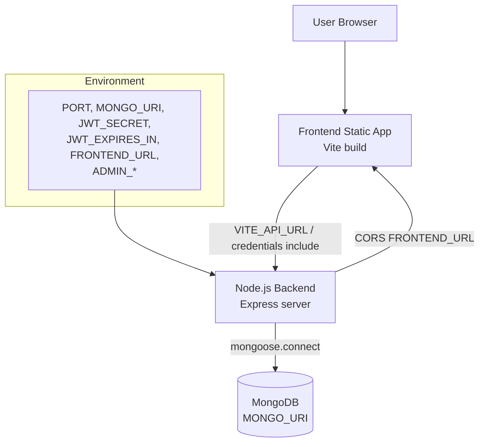
```mermaid
flowchart TB
  User[User Browser]
  FE[Frontend Static App\nVite build]
  BE[Node.js Backend\nExpress server]
  DB[(MongoDB\nMONGO_URI)]

  User --> FE
  FE -- "VITE_API_URL / credentials include" --> BE
  BE -- "CORS FRONTEND_URL" --> FE
  BE -- "mongoose.connect" --> DB

  subgraph Environment
    ENV[PORT, MONGO_URI, JWT_SECRET,\nJWT_EXPIRES_IN, FRONTEND_URL,\nADMIN_*]
  end
  ENV --> BE
```

#### PlantUML Source

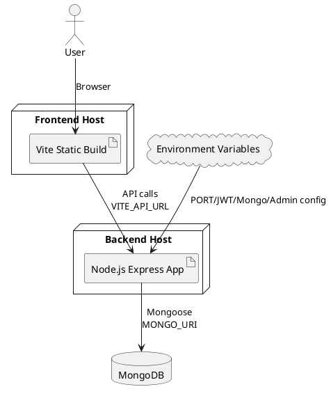
```plantuml
@startuml
actor User
node "Frontend Host" {
  artifact "Vite Static Build" as FE
}
node "Backend Host" {
  artifact "Node.js Express App" as BE
}
database "MongoDB" as DB
cloud "Environment Variables" as ENV

User --> FE : Browser
FE --> BE : API calls\nVITE_API_URL
BE --> DB : Mongoose\nMONGO_URI
ENV --> BE : PORT/JWT/Mongo/Admin config
@enduml
```

#### Diagram Explanation

The backend starts from `BACKEND/server.js`, connects to MongoDB, and listens on `PORT` or 5000. The frontend uses `VITE_API_URL` or defaults to `http://localhost:5000/api/v1`. CORS is constrained by `FRONTEND_URL` or `http://localhost:5173`.

## UML Diagrams

### Use Case Diagram

#### Mermaid Source

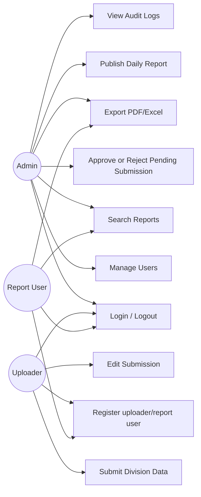
```mermaid
flowchart LR
  Admin((Admin))
  Uploader((Uploader))
  ReportUser((Report User))

  Login[Login / Logout]
  Register[Register uploader/report user]
  ManageUsers[Manage Users]
  Submit[Submit Division Data]
  Edit[Edit Submission]
  Review[Approve or Reject Pending Submission]
  Publish[Publish Daily Report]
  Search[Search Reports]
  Export[Export PDF/Excel]
  Audit[View Audit Logs]

  Admin --> Login
  Admin --> ManageUsers
  Admin --> Review
  Admin --> Publish
  Admin --> Search
  Admin --> Export
  Admin --> Audit

  Uploader --> Login
  Uploader --> Register
  Uploader --> Submit
  Uploader --> Edit

  ReportUser --> Login
  ReportUser --> Register
  ReportUser --> Search
  ReportUser --> Export
```

#### PlantUML Source

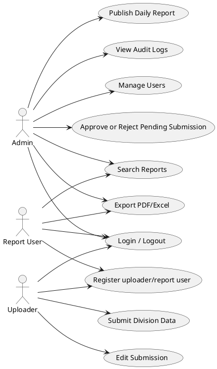
```plantuml
@startuml
left to right direction
actor Admin
actor Uploader
actor "Report User" as ReportUser

usecase "Login / Logout" as Login
usecase "Register uploader/report user" as Register
usecase "Manage Users" as ManageUsers
usecase "Submit Division Data" as Submit
usecase "Edit Submission" as Edit
usecase "Approve or Reject Pending Submission" as Review
usecase "Publish Daily Report" as Publish
usecase "Search Reports" as Search
usecase "Export PDF/Excel" as Export
usecase "View Audit Logs" as Audit

Admin --> Login
Admin --> ManageUsers
Admin --> Review
Admin --> Publish
Admin --> Search
Admin --> Export
Admin --> Audit
Uploader --> Login
Uploader --> Register
Uploader --> Submit
Uploader --> Edit
ReportUser --> Login
ReportUser --> Register
ReportUser --> Search
ReportUser --> Export
@enduml
```

#### Diagram Explanation

This represents implemented role capabilities from backend routes and frontend navigation. Public registration is limited to uploader and report user accounts; admin creation is through admin UI or seed script.

### Class Diagram

#### Mermaid Source

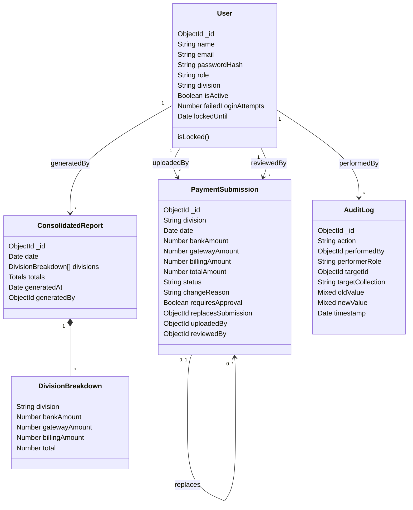
```mermaid
classDiagram
  class User {
    ObjectId _id
    String name
    String email
    String passwordHash
    String role
    String division
    Boolean isActive
    Number failedLoginAttempts
    Date lockedUntil
    isLocked()
  }

  class PaymentSubmission {
    ObjectId _id
    String division
    Date date
    Number bankAmount
    Number gatewayAmount
    Number billingAmount
    Number totalAmount
    String status
    String changeReason
    Boolean requiresApproval
    ObjectId replacesSubmission
    ObjectId uploadedBy
    ObjectId reviewedBy
  }

  class ConsolidatedReport {
    ObjectId _id
    Date date
    DivisionBreakdown[] divisions
    Totals totals
    Date generatedAt
    ObjectId generatedBy
  }

  class DivisionBreakdown {
    String division
    Number bankAmount
    Number gatewayAmount
    Number billingAmount
    Number total
  }

  class AuditLog {
    ObjectId _id
    String action
    ObjectId performedBy
    String performerRole
    ObjectId targetId
    String targetCollection
    Mixed oldValue
    Mixed newValue
    Date timestamp
  }

  User "1" --> "*" PaymentSubmission : uploadedBy
  User "1" --> "*" PaymentSubmission : reviewedBy
  PaymentSubmission "0..1" --> "0..*" PaymentSubmission : replaces
  ConsolidatedReport "1" *-- "*" DivisionBreakdown
  User "1" --> "*" ConsolidatedReport : generatedBy
  User "1" --> "*" AuditLog : performedBy
```

#### PlantUML Source

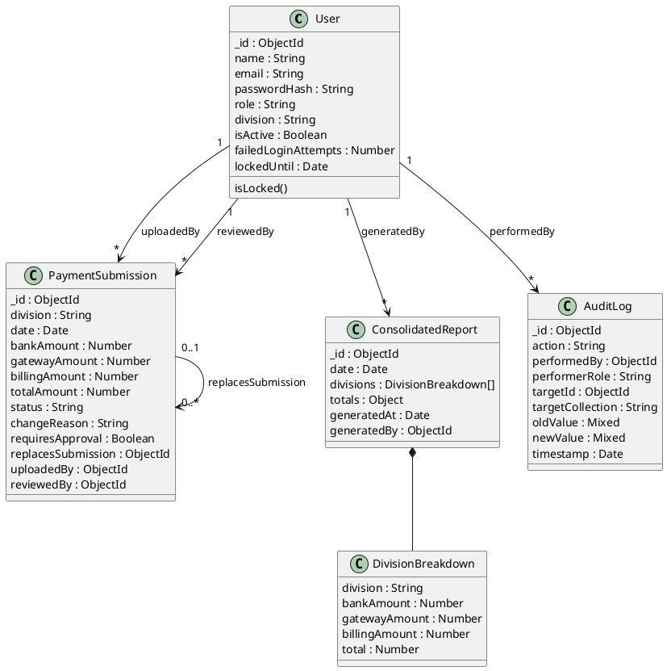
```plantuml
@startuml
class User {
  _id : ObjectId
  name : String
  email : String
  passwordHash : String
  role : String
  division : String
  isActive : Boolean
  failedLoginAttempts : Number
  lockedUntil : Date
  isLocked()
}

class PaymentSubmission {
  _id : ObjectId
  division : String
  date : Date
  bankAmount : Number
  gatewayAmount : Number
  billingAmount : Number
  totalAmount : Number
  status : String
  changeReason : String
  requiresApproval : Boolean
  replacesSubmission : ObjectId
  uploadedBy : ObjectId
  reviewedBy : ObjectId
}

class ConsolidatedReport {
  _id : ObjectId
  date : Date
  divisions : DivisionBreakdown[]
  totals : Object
  generatedAt : Date
  generatedBy : ObjectId
}

class DivisionBreakdown {
  division : String
  bankAmount : Number
  gatewayAmount : Number
  billingAmount : Number
  total : Number
}

class AuditLog {
  _id : ObjectId
  action : String
  performedBy : ObjectId
  performerRole : String
  targetId : ObjectId
  targetCollection : String
  oldValue : Mixed
  newValue : Mixed
  timestamp : Date
}

User "1" --> "*" PaymentSubmission : uploadedBy
User "1" --> "*" PaymentSubmission : reviewedBy
PaymentSubmission "0..1" --> "0..*" PaymentSubmission : replacesSubmission
ConsolidatedReport *-- DivisionBreakdown
User "1" --> "*" ConsolidatedReport : generatedBy
User "1" --> "*" AuditLog : performedBy
@enduml
```

#### Diagram Explanation

The classes reflect Mongoose models rather than separate domain service classes. Controllers and services are functional modules, not classes.

### Sequence Diagram - Login

#### Mermaid Source

```mermaid
sequenceDiagram
  actor User
  participant SPA as React Login
  participant API as POST /auth/login
  participant DB as User Collection
  participant JWT as JWT Utility
  participant Audit as Audit Service

  User->>SPA: Submit email/password
  SPA->>API: POST /api/v1/auth/login
  API->>DB: find user by email with password/lock fields
  alt inactive or missing
    API->>Audit: LOGIN_FAILED
    API-->>SPA: 401
  else locked
    API-->>SPA: 423
  else invalid password
    API->>DB: increment failed attempts; maybe lock
    API->>Audit: LOGIN_FAILED
    API-->>SPA: 401
  else valid password
    API->>DB: reset failed attempts
    API->>JWT: signToken
    API->>Audit: LOGIN
    API-->>SPA: 200 + user + httpOnly cookie
  end
```

#### PlantUML Source

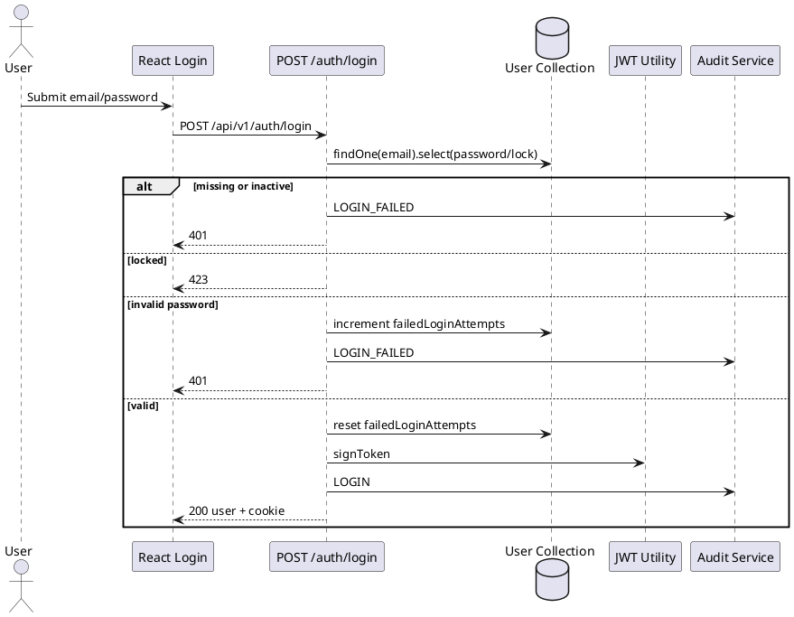
```plantuml
@startuml
actor User
participant "React Login" as SPA
participant "POST /auth/login" as API
database "User Collection" as DB
participant "JWT Utility" as JWT
participant "Audit Service" as Audit

User -> SPA : Submit email/password
SPA -> API : POST /api/v1/auth/login
API -> DB : findOne(email).select(password/lock)
alt missing or inactive
  API -> Audit : LOGIN_FAILED
  API --> SPA : 401
else locked
  API --> SPA : 423
else invalid password
  API -> DB : increment failedLoginAttempts
  API -> Audit : LOGIN_FAILED
  API --> SPA : 401
else valid
  API -> DB : reset failedLoginAttempts
  API -> JWT : signToken
  API -> Audit : LOGIN
  API --> SPA : 200 user + cookie
end
@enduml
```

#### Diagram Explanation

Login verifies user existence, active status, lockout, and password. Successful login resets lock fields and sends a JWT cookie.

### Sequence Diagram - User Management

#### Mermaid Source

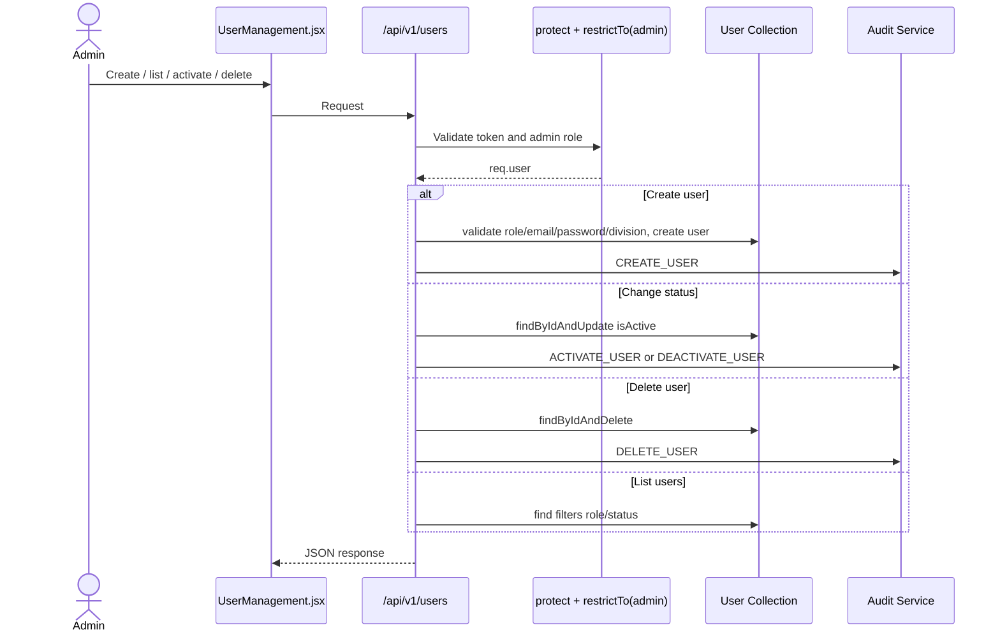
```mermaid
sequenceDiagram
  actor Admin
  participant UI as UserManagement.jsx
  participant API as /api/v1/users
  participant Auth as protect + restrictTo(admin)
  participant DB as User Collection
  participant Audit as Audit Service

  Admin->>UI: Create / list / activate / delete
  UI->>API: Request
  API->>Auth: Validate token and admin role
  Auth-->>API: req.user
  alt Create user
    API->>DB: validate role/email/password/division, create user
    API->>Audit: CREATE_USER
  else Change status
    API->>DB: findByIdAndUpdate isActive
    API->>Audit: ACTIVATE_USER or DEACTIVATE_USER
  else Delete user
    API->>DB: findByIdAndDelete
    API->>Audit: DELETE_USER
  else List users
    API->>DB: find filters role/status
  end
  API-->>UI: JSON response
```

#### PlantUML Source

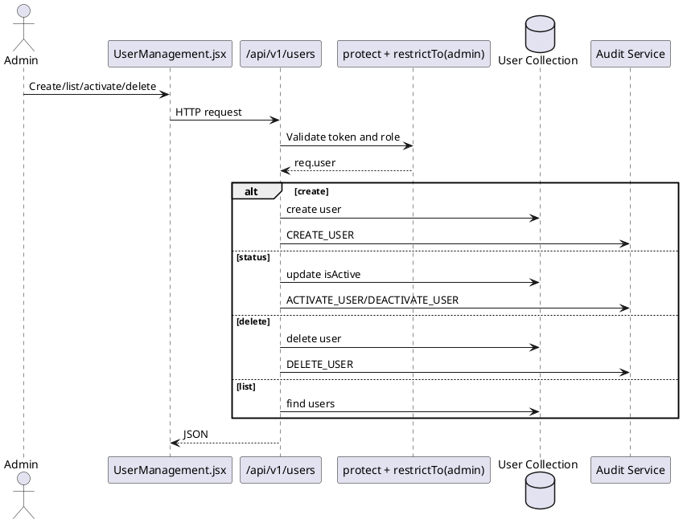
```plantuml
@startuml
actor Admin
participant "UserManagement.jsx" as UI
participant "/api/v1/users" as API
participant "protect + restrictTo(admin)" as Auth
database "User Collection" as DB
participant "Audit Service" as Audit

Admin -> UI : Create/list/activate/delete
UI -> API : HTTP request
API -> Auth : Validate token and role
Auth --> API : req.user
alt create
  API -> DB : create user
  API -> Audit : CREATE_USER
else status
  API -> DB : update isActive
  API -> Audit : ACTIVATE_USER/DEACTIVATE_USER
else delete
  API -> DB : delete user
  API -> Audit : DELETE_USER
else list
  API -> DB : find users
end
API --> UI : JSON
@enduml
```

#### Diagram Explanation

All `/users` routes are protected at router level for admin only. User changes are audited.

### Sequence Diagram - Report Submission

#### Mermaid Source

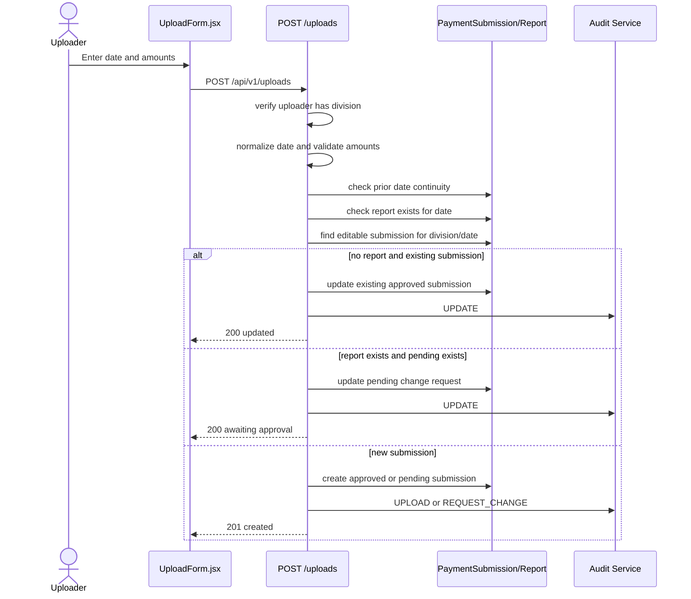
```mermaid
sequenceDiagram
  actor Uploader
  participant UI as UploadForm.jsx
  participant API as POST /uploads
  participant DB as PaymentSubmission/Report
  participant Audit as Audit Service

  Uploader->>UI: Enter date and amounts
  UI->>API: POST /api/v1/uploads
  API->>API: verify uploader has division
  API->>API: normalize date and validate amounts
  API->>DB: check prior date continuity
  API->>DB: check report exists for date
  API->>DB: find editable submission for division/date
  alt no report and existing submission
    API->>DB: update existing approved submission
    API->>Audit: UPDATE
    API-->>UI: 200 updated
  else report exists and pending exists
    API->>DB: update pending change request
    API->>Audit: UPDATE
    API-->>UI: 200 awaiting approval
  else new submission
    API->>DB: create approved or pending submission
    API->>Audit: UPLOAD or REQUEST_CHANGE
    API-->>UI: 201 created
  end
```

#### PlantUML Source

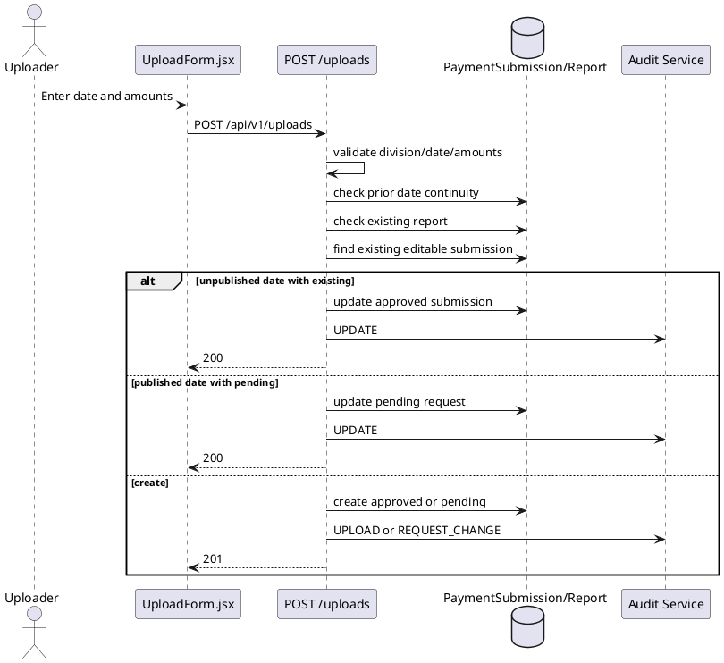
```plantuml
@startuml
actor Uploader
participant "UploadForm.jsx" as UI
participant "POST /uploads" as API
database "PaymentSubmission/Report" as DB
participant "Audit Service" as Audit

Uploader -> UI : Enter date and amounts
UI -> API : POST /api/v1/uploads
API -> API : validate division/date/amounts
API -> DB : check prior date continuity
API -> DB : check existing report
API -> DB : find existing editable submission
alt unpublished date with existing
  API -> DB : update approved submission
  API -> Audit : UPDATE
  API --> UI : 200
else published date with pending
  API -> DB : update pending request
  API -> Audit : UPDATE
  API --> UI : 200
else create
  API -> DB : create approved or pending
  API -> Audit : UPLOAD or REQUEST_CHANGE
  API --> UI : 201
end
@enduml
```

#### Diagram Explanation

Submission behavior depends on whether a consolidated report already exists for the date and whether an editable same-division submission already exists.

### Sequence Diagram - Report Approval

#### Mermaid Source

```mermaid
sequenceDiagram
  actor Admin
  participant UI as PendingReports/AdminDashboard
  participant API as PATCH /admin/uploads/:id/approve
  participant DB as PaymentSubmission
  participant Report as Report Service
  participant Audit as Audit Service

  Admin->>UI: Approve pending submission
  UI->>API: PATCH approve with comment
  API->>DB: find submission
  API->>API: require status pending
  alt replaces approved submission
    API->>DB: mark replaced submission superseded
    API->>Audit: SUPERSEDE
  end
  API->>DB: mark pending submission approved
  API->>Report: generateConsolidatedReport(date, adminId)
  Report->>DB: read approved submissions for date
  Report->>DB: upsert consolidated report
  API->>Audit: APPROVE
  API->>Audit: REPORT_GENERATION
  API-->>UI: approved submission + regenerated report
```

#### PlantUML Source

```plantuml
@startuml
actor Admin
participant "PendingReports/AdminDashboard" as UI
participant "PATCH approve" as API
database "PaymentSubmission" as DB
participant "Report Service" as Report
participant "Audit Service" as Audit

Admin -> UI : Approve
UI -> API : PATCH /admin/uploads/:id/approve
API -> DB : find submission
API -> API : require pending
alt replaces approved
  API -> DB : status = superseded
  API -> Audit : SUPERSEDE
end
API -> DB : status = approved
API -> Report : generateConsolidatedReport
Report -> DB : read approved submissions
Report -> DB : upsert consolidated report
API -> Audit : APPROVE
API -> Audit : REPORT_GENERATION
API --> UI : JSON
@enduml
```

#### Diagram Explanation

Approval may supersede an old approved submission, then regenerates the consolidated report for the submission date.

### Sequence Diagram - Search Workflow

#### Mermaid Source

```mermaid
sequenceDiagram
  actor Viewer as Admin/Report User
  participant UI as ReportSearch.jsx
  participant Hook as useReports
  participant API as GET /reports
  participant DB as ConsolidatedReport
  participant Export as Export Endpoints

  Viewer->>UI: Set date/division/source filters
  UI->>Hook: applied filters
  Hook->>API: GET /api/v1/reports?from&to&division
  API->>DB: find reports, populate generatedBy
  API-->>Hook: reports
  Hook-->>UI: flattened rows
  UI->>UI: source filter by non-zero amount
  opt export
    Viewer->>UI: Click PDF/Excel
    UI->>Export: GET /reports/:date/export/pdf or excel
    Export-->>UI: downloaded file
  end
```

#### PlantUML Source

```plantuml
@startuml
actor "Admin/Report User" as Viewer
participant "ReportSearch.jsx" as UI
participant useReports as Hook
participant "GET /reports" as API
database ConsolidatedReport as DB
participant "Export Endpoints" as Export

Viewer -> UI : Set filters
UI -> Hook : applied filters
Hook -> API : GET /api/v1/reports
API -> DB : find reports
API --> Hook : reports
Hook --> UI : rows
UI -> UI : source filter
opt export
  Viewer -> UI : Click PDF/Excel
  UI -> Export : GET export endpoint
  Export --> UI : file download
end
@enduml
```

#### Diagram Explanation

Date and division filtering are backend-supported. Source filtering is implemented client-side by checking whether the selected amount field is greater than zero.

### Activity Diagram - Authentication

#### Mermaid Source

```mermaid
flowchart TD
  A[Start login] --> B{Email and password supplied?}
  B -- No --> C[400]
  B -- Yes --> D[Find active user]
  D --> E{User found and active?}
  E -- No --> F[Audit LOGIN_FAILED\nReturn 401]
  E -- Yes --> G{Locked?}
  G -- Yes --> H[Return 423]
  G -- No --> I{Password matches?}
  I -- No --> J[Increment failures\nMaybe set lockedUntil\nAudit LOGIN_FAILED\nReturn 401]
  I -- Yes --> K[Reset failures\nSign JWT\nSet cookie\nAudit LOGIN\nReturn user]
```

#### PlantUML Source

```plantuml
@startuml
start
if (Email and password supplied?) then (yes)
  :Find user with password and lock fields;
  if (User found and active?) then (yes)
    if (Locked?) then (yes)
      :Return 423;
    else (no)
      if (Password matches?) then (yes)
        :Reset failures;
        :Sign JWT and set cookie;
        :Audit LOGIN;
        :Return user;
      else (no)
        :Increment failures;
        :Maybe lock account;
        :Audit LOGIN_FAILED;
        :Return 401;
      endif
    endif
  else (no)
    :Audit LOGIN_FAILED;
    :Return 401;
  endif
else (no)
  :Return 400;
endif
stop
@enduml
```

#### Diagram Explanation

Authentication includes validation, inactive-user rejection, temporary lockout, JWT creation, and audit logging.

### Activity Diagram - Authorization

#### Mermaid Source

```mermaid
flowchart TD
  A[Incoming protected request] --> B{Cookie token or Bearer token?}
  B -- No --> C[401 not logged in]
  B -- Yes --> D{JWT_SECRET configured?}
  D -- No --> E[500]
  D -- Yes --> F{JWT verifies?}
  F -- No --> G[401 invalid/expired]
  F -- Yes --> H[Load user]
  H --> I{User exists and active?}
  I -- No --> J[401 inactive/missing]
  I -- Yes --> K{Route role allowed?}
  K -- No --> L[403 forbidden]
  K -- Yes --> M[Controller executes]
```

#### PlantUML Source

```plantuml
@startuml
start
if (Token present?) then (yes)
  if (JWT_SECRET configured?) then (yes)
    if (JWT verifies?) then (yes)
      :Load user;
      if (User exists and active?) then (yes)
        if (Role allowed?) then (yes)
          :Execute controller;
        else (no)
          :403 forbidden;
        endif
      else (no)
        :401 inactive/missing;
      endif
    else (no)
      :401 invalid/expired;
    endif
  else (no)
    :500;
  endif
else (no)
  :401 not logged in;
endif
stop
@enduml
```

#### Diagram Explanation

`protect` authenticates and attaches `req.user`; `restrictTo` enforces role membership.

### Activity Diagram - User Lifecycle

#### Mermaid Source

```mermaid
flowchart TD
  A[User account needed] --> B{Created how?}
  B -->|Public register| C[Only uploader/report_user]
  B -->|Admin UI/API| D[Any allowed role]
  B -->|Seed script| E[Admin account]
  C --> F[Active user]
  D --> F
  E --> F
  F --> G{Admin status change?}
  G -->|Deactivate| H[Inactive; login denied]
  G -->|Activate| F
  F --> I{Admin delete?}
  I -->|Self-delete attempt| J[400 blocked]
  I -->|Other user| K[Deleted]
```

#### PlantUML Source

```plantuml
@startuml
start
:User account needed;
if (Created how?) then (Public register)
  :Create uploader/report_user only;
elseif (Admin API)
  :Create allowed role;
else (Seed script)
  :Create/reset admin;
endif
:Active user;
if (Admin deactivates?) then (yes)
  :Inactive; 
  :Login denied;
else (no)
endif
if (Admin deletes?) then (yes)
  if (Own account?) then (yes)
    :400 blocked;
  else (no)
    :Deleted;
  endif
endif
stop
@enduml
```

#### Diagram Explanation

The user lifecycle is implemented through public registration, admin management, and seeding. Deactivation is reversible; deletion removes the user document.

### Activity Diagram - Report Lifecycle

#### Mermaid Source

```mermaid
flowchart TD
  A[Approved submissions exist for date] --> B[Admin publishes report]
  B --> C{Previous report continuity ok?}
  C -- No --> D[400 publish back date first]
  C -- Yes --> E[Read approved submissions]
  E --> F[Aggregate by division]
  F --> G[Compute totals]
  G --> H[Upsert consolidated report by unique date]
  H --> I[Audit REPORT_PUBLICATION]
  I --> J[Report searchable/exportable]
  J --> K{Post-publication change approved?}
  K -- Yes --> E
```

#### PlantUML Source

```plantuml
@startuml
start
:Admin publishes report;
if (Previous report continuity ok?) then (yes)
  :Read approved submissions;
  :Aggregate by division;
  :Compute totals;
  :Upsert consolidated report by date;
  :Audit REPORT_PUBLICATION;
  :Report searchable/exportable;
  if (Post-publication change approved?) then (yes)
    :Regenerate report;
  endif
else (no)
  :Return 400 publish back date first;
endif
stop
@enduml
```

#### Diagram Explanation

Reports are generated from approved submissions for a date and upserted by date.

### State Diagram - Payment Submission

#### Mermaid Source

```mermaid
stateDiagram-v2
  [*] --> approved: initial upload before publication
  [*] --> pending: post-publication change request
  approved --> approved: pre-publication edit
  approved --> pending: post-publication edit creates change request
  pending --> pending: uploader updates pending request
  pending --> approved: admin approves
  pending --> rejected: admin rejects
  approved --> superseded: replaced correction approved
  rejected --> [*]
  superseded --> [*]
```

#### PlantUML Source

```plantuml
@startuml
[*] --> approved : initial upload before publication
[*] --> pending : post-publication change request
approved --> approved : pre-publication edit
approved --> pending : post-publication edit creates request
pending --> pending : uploader updates pending request
pending --> approved : admin approves
pending --> rejected : admin rejects
approved --> superseded : replacement approved
rejected --> [*]
superseded --> [*]
@enduml
```

#### Diagram Explanation

The model allows four statuses. Controller logic prevents editing rejected or superseded submissions.

## Business Flowcharts

### Authentication Flowchart

#### Mermaid Source

```mermaid
flowchart TD
  A[Open login page] --> B[Submit credentials]
  B --> C[Backend validates credentials]
  C --> D{Valid?}
  D -- No --> E[Audit failed login\nShow error]
  D -- Yes --> F[Set HTTP-only JWT cookie]
  F --> G[Return role]
  G --> H{Role}
  H -->|admin| I[Admin dashboard]
  H -->|uploader| J[Uploader dashboard]
  H -->|report_user| K[Report dashboard]
```

#### PlantUML Source

```plantuml
@startuml
start
:Open login page;
:Submit credentials;
:Backend validates credentials;
if (Valid?) then (yes)
  :Set HTTP-only JWT cookie;
  :Return role;
  if (admin?) then (yes)
    :Admin dashboard;
  elseif (uploader?)
    :Uploader dashboard;
  else
    :Report dashboard;
  endif
else (no)
  :Audit failed login;
  :Show error;
endif
stop
@enduml
```

#### Diagram Explanation

Frontend redirects after login using role-to-home mapping in `Login.jsx`.

### Authorization Flowchart

#### Mermaid Source

```mermaid
flowchart TD
  A[Protected API request] --> B[Read JWT from cookie or Bearer header]
  B --> C{Token present and valid?}
  C -- No --> D[401 response]
  C -- Yes --> E[Load user by token id]
  E --> F{User exists and active?}
  F -- No --> G[401 response]
  F -- Yes --> H[Attach user to request]
  H --> I{Route has role restriction?}
  I -- No --> J[Controller handles request]
  I -- Yes --> K{User role allowed?}
  K -- No --> L[403 response]
  K -- Yes --> J
```

#### PlantUML Source

```plantuml
@startuml
start
:Protected API request;
:Read JWT from cookie or Bearer header;
if (Token present and valid?) then (yes)
  :Load user by token id;
  if (User exists and active?) then (yes)
    :Attach user to request;
    if (Route has role restriction?) then (yes)
      if (User role allowed?) then (yes)
        :Controller handles request;
      else (no)
        :403 response;
      endif
    else (no)
      :Controller handles request;
    endif
  else (no)
    :401 response;
  endif
else (no)
  :401 response;
endif
stop
@enduml
```

#### Diagram Explanation

This flow maps to `protect` and `restrictTo` in `BACKEND/src/middleware/auth.middleware.js`.

### User Lifecycle Flowchart

#### Mermaid Source

```mermaid
flowchart TD
  A[Account creation request] --> B{Creation path}
  B -->|Public register| C[Validate uploader/report_user only]
  B -->|Admin user management| D[Validate admin/uploader/report_user]
  B -->|Seed script| E[Create or reset admin]
  C --> F[Store bcrypt password hash]
  D --> F
  E --> F
  F --> G[User active by default]
  G --> H{Admin action}
  H -->|Deactivate| I[isActive false]
  I --> J[Login/protected access denied]
  H -->|Activate| K[isActive true]
  K --> G
  H -->|Delete other user| L[Remove user document]
  H -->|Delete self| M[400 blocked]
```

#### PlantUML Source

```plantuml
@startuml
start
:Account creation request;
if (Creation path?) then (Public register)
  :Validate uploader/report_user only;
elseif (Admin user management)
  :Validate admin/uploader/report_user;
else (Seed script)
  :Create or reset admin;
endif
:Store bcrypt password hash;
:User active by default;
if (Admin action?) then (Deactivate)
  :isActive false;
  :Login/protected access denied;
elseif (Activate)
  :isActive true;
elseif (Delete other user)
  :Remove user document;
else (Delete self)
  :400 blocked;
endif
stop
@enduml
```

#### Diagram Explanation

User creation and lifecycle transitions are implemented in `auth.controller.js`, `user.controller.js`, and `scripts/seedAdmin.js`.

### Report Lifecycle Flowchart

#### Mermaid Source

```mermaid
flowchart TD
  A[Uploader submissions for date] --> B{Report already published?}
  B -- No --> C[Submission stored/edited as approved]
  C --> D[Admin publishes date]
  D --> E[Generate consolidated report from approved submissions]
  E --> F[Report status exposed as published]
  B -- Yes --> G[Uploader change stored as pending]
  G --> H{Admin decision}
  H -- Approve --> I[Approve change and regenerate report]
  I --> F
  H -- Reject --> J[Submission rejected; report unchanged]
  F --> K[Report searchable/viewable/exportable]
```

#### PlantUML Source

```plantuml
@startuml
start
:Uploader submissions for date;
if (Report already published?) then (no)
  :Submission stored/edited as approved;
  :Admin publishes date;
  :Generate consolidated report from approved submissions;
  :Report status exposed as published;
else (yes)
  :Uploader change stored as pending;
  if (Admin approves?) then (yes)
    :Approve change and regenerate report;
    :Report status exposed as published;
  else (reject)
    :Submission rejected; report unchanged;
  endif
endif
:Report searchable/viewable/exportable;
stop
@enduml
```

#### Diagram Explanation

The report lifecycle combines upload behavior from `upload.controller.js`, publication and approval behavior from `admin.controller.js`, and retrieval/export behavior from `report.controller.js`.

### Approval Workflow Flowchart

#### Mermaid Source

```mermaid
flowchart TD
  A[Pending submission] --> B[Admin reviews]
  B --> C{Approve?}
  C -- Yes --> D{Replaces approved submission?}
  D -- Yes --> E[Mark previous approved submission superseded]
  D -- No --> F[Mark pending submission approved]
  E --> F
  F --> G[Regenerate consolidated report]
  G --> H[Audit approve/report generation/supersede if applicable]
  H --> I[Return updated submission and report]
  C -- No --> J[Require rejection reason]
  J --> K[Mark submission rejected]
  K --> L[Audit reject]
```

#### PlantUML Source

```plantuml
@startuml
start
:Pending submission;
:Admin reviews;
if (Approve?) then (yes)
  if (Replaces approved submission?) then (yes)
    :Mark previous approved submission superseded;
  endif
  :Mark pending submission approved;
  :Regenerate consolidated report;
  :Audit approve/report generation/supersede;
  :Return updated submission and report;
else (no)
  :Require rejection reason;
  :Mark submission rejected;
  :Audit reject;
endif
stop
@enduml
```

#### Diagram Explanation

Approval and rejection are separate API routes but share the pending-only precondition.

### Rejection Workflow Flowchart

#### Mermaid Source

```mermaid
flowchart TD
  A[Admin clicks reject] --> B[Prompt reason in frontend]
  B --> C{Reason supplied?}
  C -- No --> D[Cancel action]
  C -- Yes --> E[PATCH /admin/uploads/:id/reject]
  E --> F{Submission pending?}
  F -- No --> G[400 only pending submissions can be rejected]
  F -- Yes --> H[Set status rejected]
  H --> I[Set reviewedBy and reviewComment]
  I --> J[Audit REJECT]
  J --> K[Frontend reloads pending/rejected lists]
```

#### PlantUML Source

```plantuml
@startuml
start
:Admin clicks reject;
:Prompt reason;
if (Reason supplied?) then (yes)
  :PATCH reject endpoint;
  if (Submission pending?) then (yes)
    :Set status rejected;
    :Set reviewedBy and reviewComment;
    :Audit REJECT;
    :Reload lists;
  else (no)
    :Return 400;
  endif
else (no)
  :Cancel action;
endif
stop
@enduml
```

#### Diagram Explanation

Backend enforces the reason requirement. Frontend uses `window.prompt` for reason collection.

### Audit Logging Flowchart

#### Mermaid Source

```mermaid
flowchart TD
  A[Business action occurs] --> B[Controller calls logAudit]
  B --> C[Collect req.user, IP, user-agent]
  C --> D[Create AuditLog document]
  D --> E{Audit write succeeds?}
  E -- Yes --> F[Continue normal response]
  E -- No --> G[Console error only]
  G --> F
```

#### PlantUML Source

```plantuml
@startuml
start
:Business action occurs;
:Controller calls logAudit;
:Collect req.user, IP, user-agent;
:Create AuditLog document;
if (Audit write succeeds?) then (yes)
  :Continue normal response;
else (no)
  :Console error only;
  :Continue normal response;
endif
stop
@enduml
```

#### Diagram Explanation

Audit logging is best-effort. The service catches its own errors and does not fail the primary transaction.

### Search and Retrieval Flowchart

#### Mermaid Source

```mermaid
flowchart TD
  A[User opens search] --> B[Enter date/division/source]
  B --> C[Frontend applies date/division to API query]
  C --> D[Backend queries consolidatedReports]
  D --> E[Backend optionally filters embedded divisions]
  E --> F[Frontend flattens report divisions into rows]
  F --> G{Source selected?}
  G -- Yes --> H[Keep rows with selected source amount > 0]
  G -- No --> I[Show all rows]
  H --> J[View detail or export]
  I --> J
```

#### PlantUML Source

```plantuml
@startuml
start
:Open search;
:Enter date/division/source;
:API query uses date/division;
:Backend queries consolidatedReports;
:Backend filters embedded divisions if requested;
:Frontend flattens divisions;
if (Source selected?) then (yes)
  :Keep rows with source amount > 0;
else (no)
  :Show all rows;
endif
:View detail or export;
stop
@enduml
```

#### Diagram Explanation

Backend search supports date range and division. Source filtering is implemented in the frontend.

## Security Design

- Authentication token is a JWT signed with `JWT_SECRET`.
- Token is sent as an HTTP-only cookie with `sameSite: strict`; secure cookies are enabled only when `NODE_ENV === "production"`.
- Backend also accepts `Authorization: Bearer <token>`.
- Passwords are stored as bcrypt hashes.
- Password hashes, failed login counters, and lock timestamps are excluded from default Mongoose queries.
- Inactive users cannot authenticate or pass protected middleware.
- Authorization is role-based using route-level `restrictTo`.
- CORS origin is configured from `FRONTEND_URL`, defaulting to `http://localhost:5173`, with credentials enabled.
- No CSRF token implementation is present in code; cookie auth relies on `sameSite: strict`.
- No rate-limiting middleware is present; lockout is user-account based after failed password attempts.

## Deployment Design

Backend required environment variables:

| Variable | Purpose |
|---|---|
| `PORT` | Express listen port; default 5000 |
| `MONGO_URI` | MongoDB connection string; required |
| `JWT_SECRET` | JWT signing secret; required for protected routes and token signing |
| `JWT_EXPIRES_IN` | JWT expiry; default 8h |
| `FRONTEND_URL` | Allowed CORS origin |
| `ADMIN_NAME` | Seed script admin name |
| `ADMIN_EMAIL` | Seed script admin email |
| `ADMIN_PASSWORD` | Seed script admin password |

Frontend environment variable:

| Variable | Purpose |
|---|---|
| `VITE_API_URL` | Backend API base URL; default `http://localhost:5000/api/v1` |

Deployment flow:

1. Configure backend environment.
2. Run `npm run seed:admin` in `BACKEND` if admin account is needed.
3. Start backend with `npm start` or development mode with `npm run dev`.
4. Configure frontend `VITE_API_URL`.
5. Build frontend with `npm run build`.
6. Serve the generated frontend static assets from a static host or web server.

## Maintenance Notes

- Keep route documentation synchronized with `BACKEND/src/routes/*.routes.js`; the Postman collection currently includes endpoints not implemented in routes.
- Consider adding backend tests for publication continuity, backdate upload rules, and post-publication change approval.
- Consider adding indexes or uniqueness rules if business requires one active submission per division/date. Current code finds editable submissions but does not enforce uniqueness at database level.
- Consider validating frontend division options against backend rules. Backend accepts arbitrary division strings for uploader user creation and submissions through assigned user division.
- Audit logging stores `oldValue` and `newValue` as mixed snapshots; this is flexible but can grow documents if payloads expand.
- Report generation is an upsert by date and recalculates from approved submissions each time.
- Export endpoints audit every PDF/Excel export.
